# Software Requirements Specification (SRS)

## Store Inventory Management System (SIMS)

**Project Code:** AD-XPDC  
**Document Version:** 2.0  
**Prepared By:** Development Team (Ammar Ibrahim, Syazwan, Irfan)  
**Organization:** Engineering Department  
**Date:** February 4, 2026  
**Status:** Final Release

---

## Document Revision History

| Version | Date       | Author           | Description of Changes                                                        |
| ------- | ---------- | ---------------- | ----------------------------------------------------------------------------- |
| 1.0     | 2026-02-03 | Ammar Ibrahim    | Initial SRS draft with basic requirements                                     |
| 1.1     | 2026-02-03 | Ammar Ibrahim    | Documentation alignment and reference updates                                 |
| 2.0     | 2026-02-04 | Development Team | Comprehensive SRS with detailed specifications, diagrams, and project context |

---

## Document Approval

| Role                  | Name                       | Signature                  | Date             |
| --------------------- | -------------------------- | -------------------------- | ---------------- |
| Project Manager       | Ammar Ibrahim              | **\*\*\*\***\_**\*\*\*\*** | \***\*\_\_\*\*** |
| Technical Lead        | Ammar Ibrahim              | **\*\*\*\***\_**\*\*\*\*** | \***\*\_\_\*\*** |
| Quality Assurance     | Development Team           | **\*\*\*\***\_**\*\*\*\*** | \***\*\_\_\*\*** |
| Client Representative | **\*\*\*\***\_**\*\*\*\*** | **\*\*\*\***\_**\*\*\*\*** | \***\*\_\_\*\*** |

---

## Table of Contents

1. [Introduction](#1-introduction)
   - 1.1 Purpose
   - 1.2 Document Conventions
   - 1.3 Intended Audience and Reading Suggestions
   - 1.4 Project Scope
   - 1.5 Definitions, Acronyms, and Abbreviations
   - 1.6 References
   - 1.7 Document Organization

2. [Overall Description](#2-overall-description)
   - 2.1 Product Perspective
   - 2.2 System Context
   - 2.3 Product Features
   - 2.4 User Classes and Characteristics
   - 2.5 Operating Environment
   - 2.6 Design and Implementation Constraints
   - 2.7 User Documentation
   - 2.8 Assumptions and Dependencies

3. [System Features and Requirements](#3-system-features-and-requirements)
   - 3.1 Authentication and Authorization System
   - 3.2 User and Group Management
   - 3.3 Master Data Management
   - 3.4 Inventory Operations Management
   - 3.5 Procurement Management System
   - 3.6 Maintenance Management Integration
   - 3.7 Reporting and Analytics System

4. [External Interface Requirements](#4-external-interface-requirements)
   - 4.1 User Interfaces
   - 4.2 Hardware Interfaces
   - 4.3 Software Interfaces
   - 4.4 Communication Interfaces

5. [System Architecture and Design](#5-system-architecture-and-design)
   - 5.1 System Architecture Overview
   - 5.2 Technology Stack
   - 5.3 Database Design
   - 5.4 Component Architecture

6. [Nonfunctional Requirements](#6-nonfunctional-requirements)
   - 6.1 Performance Requirements
   - 6.2 Security Requirements
   - 6.3 Software Quality Attributes
   - 6.4 Business Rules

7. [Project Context and Development](#7-project-context-and-development)
   - 7.1 Development Methodology
   - 7.2 Team Structure and Roles
   - 7.3 Project Timeline
   - 7.4 Development Tools

8. [Other Requirements](#8-other-requirements)
   - 8.1 Legal and Regulatory Requirements
   - 8.2 Internationalization Requirements

9. [Appendices](#9-appendices)
   - Appendix A: Use Case Diagrams
   - Appendix B: Data Flow Diagrams
   - Appendix C: Entity Relationship Diagrams
   - Appendix D: Sequence Diagrams
   - Appendix E: User Interface Mockups
   - Appendix F: Glossary

---

## 1. Introduction

### 1.1 Purpose

This Software Requirements Specification (SRS) document provides a comprehensive description of the Store Inventory Management System (SIMS). The document specifies all functional and nonfunctional requirements for the system, serving as the primary reference for development, testing, and validation activities.

The intended audiences for this document include:

- **Development Team**: For implementation guidance and technical specifications
- **Project Stakeholders**: For understanding system capabilities and project scope
- **Quality Assurance Team**: For test planning and validation criteria
- **System Administrators**: For deployment and configuration requirements
- **End Users**: For understanding system functionality and features
- **Maintenance Team**: For future system enhancements and support

### 1.2 Document Conventions

This document follows IEEE Std 830-1998 guidelines for Software Requirements Specifications. The following conventions are used throughout:

- **SHALL**: Indicates a mandatory requirement that must be implemented
- **SHOULD**: Indicates a recommended requirement with high priority
- **MAY**: Indicates an optional requirement or feature
- **Priority Levels**:
  - High: Critical functionality required for system operation
  - Medium: Important functionality that enhances system value
  - Low: Nice-to-have features that can be implemented later

Requirements are numbered using the format FR-XXX (Functional Requirements) and NFR-XXX (Nonfunctional Requirements) for clear traceability.

### 1.3 Intended Audience and Reading Suggestions

**For Developers**: Focus on Sections 3 (System Features), 4 (External Interfaces), and 5 (System Architecture) for detailed implementation specifications.

**For Project Managers**: Review Section 2 (Overall Description) and Section 7 (Project Context) for scope, timeline, and resource understanding.

**For End Users**: Sections 2.4 (User Classes) and 3 (System Features) describe functionality available to different user roles.

**For Testers**: Section 3 (System Features) provides detailed functional requirements for test case development, while Section 6 (Nonfunctional Requirements) specifies performance and quality criteria.

### 1.4 Project Scope

The Store Inventory Management System (SIMS) is a comprehensive web-based application designed to digitalize and streamline inventory operations for engineering spare parts management. The system addresses the challenges of manual inventory tracking, procurement inefficiencies, and maintenance coordination in engineering and manufacturing environments.

**Primary Objectives:**

1. Provide real-time visibility into inventory levels across multiple storage locations
2. Automate inventory transactions with barcode-assisted operations
3. Streamline procurement workflows from requisition to purchase order management
4. Integrate maintenance operations with inventory systems
5. Generate actionable reports and analytics for data-driven decision making
6. Enforce role-based access control for security and accountability

**System Boundaries:**

The system INCLUDES:

- Web-based user interface for all inventory operations
- Firebase-based backend for authentication and data storage
- Role-based access control system
- Master data management (parts, suppliers, storage locations, assets)
- Inventory transaction processing (stock in/out, transfers, adjustments)
- Procurement workflow management (requisitions, purchase orders)
- Maintenance integration (material request forms, machine history)
- Reporting and analytics dashboards

The system EXCLUDES:

- Financial accounting and cost center management
- Human resource management
- Production planning and scheduling
- Quality control and inspection workflows
- Supplier portal and external vendor access
- Mobile native applications (web-responsive only)
- Automated email notifications (planned for future enhancement)
- Integration with existing ERP systems

**Success Criteria:**

- 100% digital tracking of all inventory transactions
- Reduction in stock discrepancies through automated tracking
- Faster procurement cycle times with streamlined approval workflows
- Enhanced visibility into inventory levels and movement history
- User adoption rate of 90% or higher among target user groups

### 1.5 Definitions, Acronyms, and Abbreviations

**Business Terms:**

- **SIMS**: Store Inventory Management System - The complete inventory management platform
- **Part**: A spare part, component, or material tracked in inventory
- **Stock Movement**: Any transaction that changes inventory quantities (in, out, transfer, adjustment)
- **Reorder Level**: Minimum stock quantity that triggers replenishment action
- **Critical Spares**: High-priority parts essential for operational continuity

**Technical Terms:**

- **RBAC**: Role-Based Access Control - Security model restricting system access based on user roles
- **CRUD**: Create, Read, Update, Delete - Basic database operations
- **Real-time**: Data updates reflected immediately without page refresh
- **Barcode Scanning**: Using barcode readers or cameras to capture part identifiers

**Operational Terms:**

- **MRF**: Material Request Form - Request submitted by maintenance for parts
- **PR**: Purchase Requisition - Internal request to initiate procurement
- **PO**: Purchase Order - Formal order sent to supplier for parts purchase
- **GRN**: Goods Receipt Note - Document confirming receipt of ordered items
- **Stock Take**: Physical count of inventory to verify system accuracy
- **Cycle Counting**: Periodic counting of specific inventory items

**Roles:**

- **Admin (A)**: System administrator with full access and user management rights
- **Storekeeper (S)**: User responsible for daily inventory operations
- **Procurement Officer (P)**: User managing supplier relationships and purchasing
- **Maintenance Technician (M)**: User requesting parts for maintenance activities

**Technical Acronyms:**

- **UI**: User Interface
- **UX**: User Experience
- **API**: Application Programming Interface
- **HTTP**: Hypertext Transfer Protocol
- **HTTPS**: Secure Hypertext Transfer Protocol
- **JSON**: JavaScript Object Notation
- **NoSQL**: Non-relational database (Firestore)
- **SPA**: Single Page Application
- **JWT**: JSON Web Token
- **KPI**: Key Performance Indicator

### 1.6 References

This SRS document references the following project artifacts:

**Project Documentation:**

1. Project README - Main project overview and getting started guide
2. Completion Report - Project status and delivered features summary
3. Documentation Index - Comprehensive guide to all project documentation
4. Quick Reference Guide - Developer guide with code examples and API references
5. Testing Guide - Test scenarios and quality assurance procedures
6. Integration Summary - Technical architecture and system integration details
7. Implementation Checklist - Feature completion tracking document

**Technical Standards:**

1. IEEE Std 830-1998 - IEEE Recommended Practice for Software Requirements Specifications
2. React.js Documentation - Frontend framework guidelines
3. Firebase Documentation - Backend services and API specifications
4. Material-UI Design Guidelines - UI component library standards

**Development Artifacts:**

1. Sprint Reports (1-4) - Detailed development progress and lessons learned
2. GitHub Repository - Source code and version control history
3. Firebase Project Console - Backend configuration and services

### 1.7 Document Organization

This SRS is organized into nine main sections:

**Section 1 (Introduction)** provides context, scope, and reference information for the entire document.

**Section 2 (Overall Description)** presents a high-level view of the system, its context, main features, user categories, and general constraints.

**Section 3 (System Features and Requirements)** contains detailed functional requirements organized by major system features. This is the most extensive section, providing specific requirements for each module.

**Section 4 (External Interface Requirements)** specifies how the system interacts with users, hardware, software, and communication systems.

**Section 5 (System Architecture and Design)** describes the technical architecture, technology choices, database design, and component structure.

**Section 6 (Nonfunctional Requirements)** defines quality attributes including performance, security, reliability, and usability requirements.

**Section 7 (Project Context and Development)** provides information about the development process, team structure, methodology, and timeline.

**Section 8 (Other Requirements)** covers additional requirements not fitting into previous categories.

**Section 9 (Appendices)** contains supplementary materials including diagrams, mockups, and detailed technical specifications.

---

## 2. Overall Description

### 2.1 Product Perspective

The Store Inventory Management System (SIMS) is a standalone web application built as a modern, cloud-based solution for inventory management in engineering environments. While designed as an independent system, SIMS is architected to potentially integrate with existing enterprise systems in the future.

**System Context:**

SIMS exists within the following context:

```
[External Systems - Future Integration]
         │
         ↓
    ┌─────────────────────────────────────┐
    │                                     │
    │   Store Inventory Management        │
    │         System (SIMS)              │
    │                                     │
    ├─────────────────────────────────────┤
    │                                     │
    │  • Web Browser Interface           │
    │  • Firebase Authentication          │
    │  • Firestore Database              │
    │  • Firebase Hosting                 │
    │                                     │
    └─────────────────────────────────────┘
         │              │
         ↓              ↓
    [Users]        [Barcode Scanners]
```

**System Interfaces:**

SIMS operates through the following primary interfaces:

- Web browser-based user interface (responsive design for desktop and tablet)
- Firebase Authentication service for user identity management
- Firestore NoSQL database for persistent data storage
- Optional barcode scanner hardware interfacing through keyboard input simulation
- Firebase Hosting for application deployment and delivery

**System Independence:**

SIMS is designed to operate independently without dependencies on external enterprise systems. All core functionality—authentication, data storage, business logic, and reporting—is self-contained within the Firebase ecosystem.

### 2.2 System Context

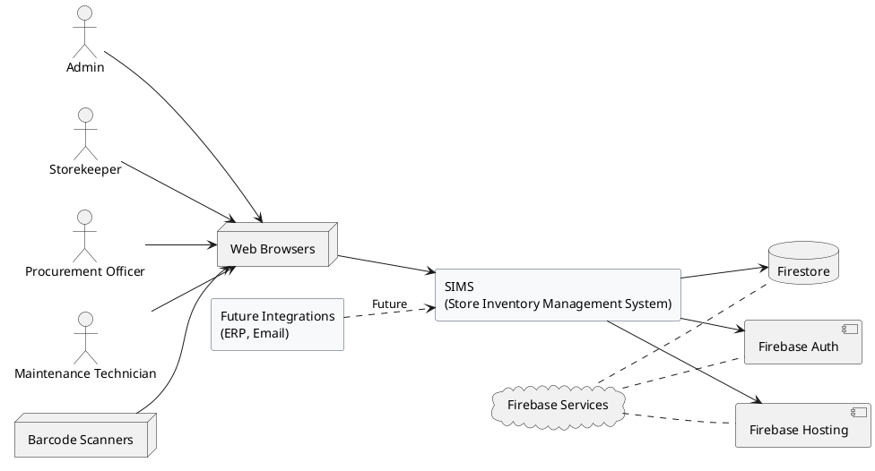

**Description**: The system context diagram should illustrate SIMS at the center, surrounded by:

- Four user roles (Admin, Storekeeper, Procurement Officer, Maintenance Technician)
- Firebase services (Authentication, Firestore, Hosting)
- Barcode scanner hardware (optional)
- Web browsers (Chrome, Edge, Firefox)
- Future integration points (ERP systems, Email services)

**User Interaction Model:**

Users interact with SIMS through a responsive web interface. The system employs a Single Page Application (SPA) architecture where users navigate between features without full page reloads. Real-time data synchronization ensures multiple users can view updated information simultaneously.

**Data Flow:**

1. Users authenticate through Firebase Authentication
2. User actions trigger Redux state updates in the browser
3. Redux thunk actions communicate with Firestore
4. Firestore applies security rules and processes data operations
5. Real-time listeners update UI immediately when data changes
6. Inventory transactions create audit trail entries automatically

### 2.3 Product Features

SIMS provides seven major feature categories, each addressing specific operational needs:

**Feature Category 1: Authentication and Access Control**

- Admin-only user account creation with system-generated passwords
- Secure login with password recovery capabilities
- Role-based access control (RBAC) limiting feature access by user group
- Session management with automatic timeout for security
- Password change and profile management

**Feature Category 2: Master Data Management**

- Parts Master: Complete catalog of spare parts with specifications, barcodes, and reorder levels
- Part Groups: Hierarchical categorization of parts for organization
- Suppliers: Vendor information including contacts, addresses, and payment terms
- Storage Locations: Multi-level storage hierarchy (warehouse → zone → bin)
- Assets/Machines: Equipment registry for maintenance tracking
- Departments: Organizational units for cost allocation

**Feature Category 3: Inventory Operations**

- Stock In: Record receipt of parts from suppliers with GRN reference
- Stock Out: Issue parts to departments, maintenance, or production
- Internal Transfers: Move inventory between storage locations
- Stock Adjustments: Correct discrepancies with approval workflow
- Stock Take: Physical inventory counting with variance analysis
- Cycle Counting: Systematic periodic counting of specific items
- Barcode Scanning: Fast data entry using barcode readers or cameras
- Movement Logs: Complete audit trail of all transactions

**Feature Category 4: Procurement Management**

- Purchase Requisitions: Internal requests for parts replenishment
- Multi-level Approval Workflow: Route requisitions through proper authorization
- Purchase Orders: Generate formal orders to suppliers
- PO Tracking: Monitor order status from placement to receipt
- Critical Spares Management: Priority handling for essential parts
- Supplier Performance: Track delivery times and quality metrics
- Requisition Dashboard: Centralized view of all procurement activities

**Feature Category 5: Maintenance Integration**

- Material Request Forms (MRF): Maintenance requests for parts
- MRF Processing: Storekeeper review and parts issuance
- Work Order Integration: Link parts consumption to specific jobs
- Machine History: Track parts usage by equipment
- Maintenance Dashboard: View pending requests and completed work

**Feature Category 6: Reporting and Analytics**

- KPI Dashboard: Real-time metrics including stock value, movement counts, low stock alerts
- Stock Inquiry: Search and view current inventory levels by location
- Stock Valuation: Calculate total inventory value using various costing methods
- Movement History: Detailed transaction logs with filtering and export
- Low Stock Report: Identify parts below reorder levels
- Supplier Performance Report: Analyze vendor delivery and quality
- Custom Date Ranges: Filter all reports by specific time periods
- Export Capabilities: Download reports in CSV or PDF format

**Feature Category 7: User and Group Management (Admin Only)**

- User CRUD Operations: Create, view, update, and delete user accounts
- User Creation: Create new user accounts with system-generated passwords
- Group Management: Define roles and assign granular permissions
- Permission Configuration: Set feature access rights per user group
- User Activity Monitoring: Track login history and system usage

### 2.4 User Classes and Characteristics

SIMS supports four distinct user classes, each with specific responsibilities, technical expertise levels, and system privileges:

**User Class 1: Administrator (Group ID: A)**

**Description**: System administrators responsible for overall system configuration, user management, and system oversight.

**Characteristics**:

- Technical Expertise: High - Comfortable with system configuration and troubleshooting
- Frequency of Use: Daily - Multiple times per day for monitoring and management
- System Knowledge: Expert - Complete understanding of all system features
- Business Domain: Comprehensive knowledge of inventory, procurement, and maintenance

**Primary Tasks**:

- Create and manage user accounts
- Define and configure user groups and permissions
- Manage all master data (parts, suppliers, locations, assets)
- Override or correct transactions when needed
- Generate comprehensive reports across all modules
- Monitor system usage and resolve user issues
- Configure system parameters and business rules

**Access Privileges**: Full system access - No restrictions on any feature or data

**Success Criteria**: Efficient user onboarding, minimal system downtime, accurate master data, proper security controls

---

**User Class 2: Storekeeper (Group ID: S)**

**Description**: Frontline inventory personnel performing daily stock transactions and maintaining inventory accuracy.

**Characteristics**:

- Technical Expertise: Medium - Familiar with basic web applications and barcode scanners
- Frequency of Use: Daily - Continuous use throughout workday
- System Knowledge: Extensive - Deep knowledge of inventory features
- Business Domain: Expert in inventory control and stock management processes

**Primary Tasks**:

- Perform stock in operations when receiving goods
- Process stock out requests from departments
- Execute internal transfers between locations
- Conduct stock takes and cycle counts
- Process Material Request Forms from maintenance
- Investigate and resolve stock discrepancies
- Generate movement logs and stock inquiry reports
- Monitor low stock alerts and notify procurement

**Access Privileges**:

- Full access to all inventory operations
- Read access to master data (parts, suppliers, locations)
- Limited access to procurement (view only)
- Read access to maintenance requests
- Generate inventory-focused reports

**Success Criteria**: Zero stock discrepancies, fast transaction processing, accurate inventory records, timely fulfillment of requests

---

**User Class 3: Procurement Officer (Group ID: P)**

**Description**: Purchasing professionals managing supplier relationships and procurement workflows.

**Characteristics**:

- Technical Expertise: Medium - Comfortable with business applications
- Frequency of Use: Daily - Regular use for procurement activities
- System Knowledge: Proficient - Strong knowledge of procurement module
- Business Domain: Expert in procurement processes, supplier management, and purchasing

**Primary Tasks**:

- Review and approve purchase requisitions
- Create and manage purchase orders
- Track order status and follow up with suppliers
- Manage critical spares list
- Maintain supplier master data
- Monitor supplier performance metrics
- Generate procurement reports and analytics
- Coordinate with storekeepers on goods receipt

**Access Privileges**:

- Full access to procurement module
- Create/edit purchase requisitions and orders
- Manage supplier master data
- Read access to inventory levels
- Generate procurement reports
- View maintenance requests (to understand demand)

**Success Criteria**: Timely procurement, cost-effective purchasing, reliable supplier relationships, maintaining optimal stock levels

---

**User Class 4: Maintenance Technician (Group ID: M)**

**Description**: Maintenance personnel requesting parts for equipment repair and maintenance activities.

**Characteristics**:

- Technical Expertise: Low to Medium - Basic computer skills, may need training
- Frequency of Use: Intermittent - Use when maintenance work requires parts
- System Knowledge: Basic - Limited to maintenance features
- Business Domain: Expert in equipment maintenance and repair procedures

**Primary Tasks**:

- Submit Material Request Forms for needed parts
- Track MRF status and approvals
- Record machine history and maintenance logs
- Link parts consumption to work orders
- View parts availability before requesting
- Update work order status
- View maintenance dashboard for assigned work

**Access Privileges**:

- Create and view own Material Request Forms
- Read access to parts availability
- Create/update machine history entries
- Limited inventory viewing (no transaction capabilities)
- View maintenance reports only

**Success Criteria**: Quick parts requisition, minimal equipment downtime, accurate maintenance records, efficient work order completion

---

**User Characteristics Summary Table:**

| Attribute         | Admin     | Storekeeper | Procurement | Maintenance  |
| ----------------- | --------- | ----------- | ----------- | ------------ |
| Technical Skill   | High      | Medium      | Medium      | Low-Medium   |
| Usage Frequency   | Daily     | Continuous  | Daily       | Intermittent |
| Training Required | 2 weeks   | 1 week      | 1 week      | 3 days       |
| Feature Count     | All (40+) | 20-25       | 15-20       | 8-10         |
| Data Access       | All       | Inventory   | Procurement | Maintenance  |

### 2.5 Operating Environment

**Client Environment:**

SIMS operates in a standard web browser environment with the following requirements:

**Supported Web Browsers:**

- Google Chrome version 90 or higher (recommended)
- Microsoft Edge version 90 or higher
- Mozilla Firefox version 88 or higher
- Safari version 14 or higher (limited testing)

**Client Hardware Requirements:**

- Desktop Computer or Laptop:
  - Processor: Intel Core i3 or equivalent (minimum)
  - RAM: 4 GB minimum, 8 GB recommended
  - Screen Resolution: 1366x768 minimum, 1920x1080 recommended
  - Network: Broadband internet connection (minimum 5 Mbps)

- Tablet Devices:
  - Screen Size: 10 inches or larger
  - Operating System: iOS 13+, Android 8+
  - RAM: 2 GB minimum
  - Network: Wi-Fi or 4G connection

**Optional Hardware:**

- USB Barcode Scanner (HID-compliant keyboard emulation mode)
- Wireless Barcode Scanner with Bluetooth connectivity
- Label Printer for barcode label generation

**Server Environment:**

SIMS is hosted on Firebase infrastructure with the following characteristics:

**Backend Services:**

- Firebase Authentication: Managed identity service
- Cloud Firestore: NoSQL document database
- Firebase Hosting: Static web hosting with CDN
- Firebase Cloud Functions: Serverless compute (if implemented)

**Server Infrastructure:**

- Hosting: Google Cloud Platform (Firebase infrastructure)
- Geographic Distribution: Multi-region availability
- Database Replication: Automatic across multiple zones
- SSL/TLS: Enforced HTTPS for all connections

**Network Requirements:**

- Stable internet connectivity required (no offline mode currently)
- Minimum bandwidth: 5 Mbps download, 2 Mbps upload
- Latency: Under 200ms for optimal performance
- Firewall: Allow HTTPS (port 443) to Firebase services
- Domains: Access to _.firebase.com, _.firebaseapp.com, \*.googleapis.com

**Development Environment:**

- Node.js: Version 18 or higher
- npm: Version 8 or higher
- Firebase CLI: Latest version
- Code Editor: VS Code recommended with extensions
- Git: For version control

### 2.6 Design and Implementation Constraints

**Technical Constraints:**

1. **Firebase Dependency**: The system is built entirely on Firebase infrastructure, limiting flexibility in choosing alternative backend services without significant redesign.

2. **NoSQL Data Model**: Firestore's document-based structure requires denormalization strategies, potentially leading to data redundancy for performance optimization.

3. **Browser Compatibility**: System requires modern JavaScript ES6+ support, limiting compatibility with older browsers (Internet Explorer not supported).

4. **Real-time Connection**: Features requiring real-time updates need persistent WebSocket connections, consuming client resources.

5. **Client-Side Processing**: Business logic executed in browser requires adequate client device performance for smooth operation.

**Security Constraints:**

1. **Firebase Authentication Only**: User authentication limited to Firebase-supported methods (email/password, no custom authentication server).

2. **Firestore Security Rules**: All data access control enforced through Firestore rules, requiring careful rule design to prevent security vulnerabilities.

3. **Client-Side Validation**: While server-side security rules exist, client-side validation can be bypassed; security rules must be comprehensive.

4. **API Key Exposure**: Firebase API keys are embedded in client code (standard Firebase practice but requires proper security rule configuration).

**Business Constraints:**

1. **Single Tenancy**: Current design supports one organization; multi-tenant architecture not implemented.

2. **No Offline Mode**: System requires internet connectivity; offline capabilities not available in current version.

3. **Language Support**: User interface in English only; internationalization not implemented.

4. **Currency**: All monetary values in single currency (configurable but not multi-currency).

**Regulatory and Policy Constraints:**

1. **Data Privacy**: Must comply with data protection regulations (GDPR, local privacy laws).

2. **Audit Trail**: All transactions must maintain complete audit trail for compliance purposes.

3. **User Authentication**: Password policies must meet minimum security standards.

4. **Data Retention**: Historical data retention per organizational policies (Firebase backup strategies required).

**Interface Constraints:**

1. **Barcode Scanner**: Must support HID keyboard emulation mode (USB or Bluetooth); proprietary scanner protocols not supported.

2. **Export Formats**: Reports limited to CSV and PDF formats; integration with Excel requires manual import.

3. **Email Notifications**: Not currently implemented; future feature requiring additional Firebase service configuration.

**Development Constraints:**

1. **React Framework**: Frontend architecture based on React 18.x, constraining development patterns and practices.

2. **Redux Toolkit**: State management implemented with Redux Toolkit, requiring specific coding patterns.

3. **Material-UI**: UI component library fixed to Material-UI v5, limiting custom styling flexibility.

4. **Firebase Quota**: Free tier usage quotas may require paid plan for production deployment (document reads, storage, bandwidth).

### 2.7 User Documentation

SIMS provides comprehensive documentation for different user audiences:

**End User Documentation:**

1. **User Manual** (Planned): Step-by-step guides for each user role covering:
   - Login and authentication procedures
   - Navigation and interface overview
   - Feature-specific workflows with screenshots
   - Common troubleshooting scenarios
   - Frequently asked questions (FAQ)

2. **Quick Start Guides**: Role-specific quick reference cards for:
   - Storekeeper: Stock in/out procedures
   - Procurement: Creating purchase orders
   - Maintenance: Submitting material requests
   - Admin: User management basics

3. **Video Tutorials** (Planned): Screen-recorded demonstrations of key workflows.

4. **Context-Sensitive Help**: In-application help tips and tooltips for form fields and actions.

**Administrator Documentation:**

1. **System Administration Guide**: Comprehensive coverage of:
   - User and group management procedures
   - Permission configuration guidelines
   - Master data setup and maintenance
   - System monitoring and maintenance
   - Backup and recovery procedures
   - Security best practices

2. **Configuration Guide**: Settings and parameters available for system customization.

**Developer Documentation:**

1. **Technical Documentation**: Complete set including:
   - Quick Reference Guide: API functions, data structures, coding patterns
   - Integration Summary: System architecture and component relationships
   - Testing Guide: Test scenarios and quality assurance procedures
   - Implementation Checklist: Feature validation and deployment readiness

2. **Code Documentation**: Inline comments and JSDoc annotations in source code.

3. **API Reference**: Firebase function signatures and usage examples.

4. **Deployment Guide**: Instructions for setting up development and production environments.

**Training Materials:**

1. **Role-Based Training Plans**: Suggested training duration and curriculum for each user class.

2. **Training Exercises**: Hands-on scenarios for practice in test environment.

3. **Certification Checklists**: Skills verification for user proficiency.

**Documentation Maintenance:**

- All documentation versioned alongside software releases
- Documentation updates included in sprint planning
- User feedback incorporated into documentation improvements
- Regular review cycle every quarter

### 2.8 Assumptions and Dependencies

**Assumptions:**

1. **User Competency**: Users have basic computer literacy and can navigate web applications with minimal training.

2. **Internet Connectivity**: Organization provides reliable internet access to all users requiring system access.

3. **Browser Support**: Users have access to modern, supported web browsers updated regularly.

4. **Data Quality**: Initial master data (parts, suppliers, locations) is accurate and complete prior to system launch.

5. **Barcode Standards**: Organization uses standard barcode formats (Code 128, EAN, QR codes) compatible with common scanners.

6. **Business Process**: Organization follows structured inventory management processes aligned with system workflows.

7. **Firebase Availability**: Firebase services maintain 99.9% uptime SLA per Google Cloud Platform agreements.

8. **User Authorization**: Organization provides clear role definitions and authorization rules for system access.

9. **Support Resources**: Technical support available for users experiencing system issues or requiring assistance.

10. **Hardware Adequacy**: User devices meet minimum hardware specifications for satisfactory performance.

**Dependencies:**

**External Service Dependencies:**

1. **Firebase Authentication**: Complete dependency on Firebase for user identity and session management.

2. **Cloud Firestore**: Database operations depend entirely on Firestore availability and performance.

3. **Firebase Hosting**: Application delivery depends on Firebase hosting infrastructure.

4. **Google Cloud Platform**: Underlying infrastructure provided by GCP; any GCP outages affect system availability.

**Technology Dependencies:**

1. **React Framework**: Frontend functionality depends on React library and ecosystem.

2. **Redux Toolkit**: State management relies on Redux Toolkit library and patterns.

3. **Material-UI**: User interface appearance and components provided by MUI library.

4. **Node.js**: Development and build processes require Node.js runtime environment.

5. **npm Packages**: Various third-party libraries for specific functionality (date handling, barcode generation, PDF export).

**Infrastructure Dependencies:**

1. **DNS Services**: Domain name resolution for accessing hosted application.

2. **SSL Certificates**: HTTPS encryption provided by Firebase (automatic certificate management).

3. **CDN Services**: Content delivery through Firebase's global CDN network.

**Data Dependencies:**

1. **Master Data Quality**: Inventory operations accuracy depends on correct master data setup.

2. **Initial Stock Levels**: System assumes accurate opening stock balances for inventory tracking.

3. **Historical Data**: Reports and analytics accuracy depends on complete transaction history.

**Operational Dependencies:**

1. **User Training**: System effectiveness depends on users receiving adequate training.

2. **Process Compliance**: Benefits realization requires users following established processes.

3. **Data Entry Discipline**: Data quality depends on accurate, timely transaction entry.

4. **System Administration**: Ongoing system health requires active administrator oversight.

**Business Dependencies:**

1. **Organizational Commitment**: Successful deployment requires management support and user adoption.

2. **Change Management**: Transition from legacy systems requires proper change management processes.

3. **Budget Allocation**: Production deployment may require Firebase paid plan for adequate quotas.

**Risk Mitigation:**

Dependencies on external services (Firebase) are mitigated by:

- Firebase's established reliability track record
- Google Cloud Platform's robust infrastructure
- Regular data exports for backup purposes
- Documented recovery procedures
- Service level agreements from Firebase/GCP

---

## 3. System Features and Requirements

This section contains detailed functional requirements organized by major system features. Each feature includes description, priority, use cases, functional requirements, and acceptance criteria.

### 3.1 Authentication and Authorization System

**Feature Description:**

The authentication and authorization system provides secure user access control, ensuring only authorized users can access the system and specific features based on their assigned roles. This system forms the security foundation for all other system features.

**Priority:** HIGH (Critical)

**Use Cases:**

**UC-3.1.1: Admin Creates User Account**

- Actor: Administrator
- Precondition: Admin is logged in with user management permissions
- Main Flow:
  1. Admin navigates to User Management page
  2. Admin clicks "Create New User" button
  3. Admin enters email, username, and selects user group
  4. System validates input data
  5. System generates secure random password
  6. System creates user account with "Active" status
  7. System displays generated password to admin
  8. Admin can copy password or send via email to new user
- Postcondition: User account created and ready for login
- Alternative Flows:
  - Email already exists: System displays error message
  - Invalid data: System highlights validation errors

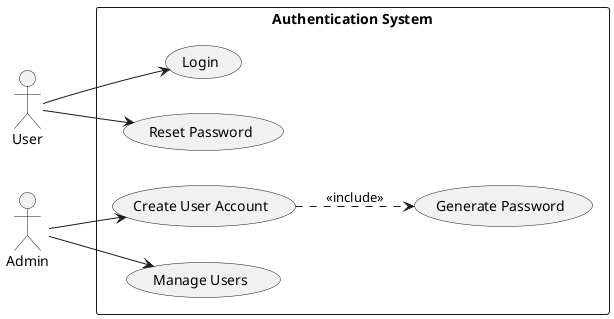

**UC-3.1.2: User Login**

- Actor: Registered User
- Precondition: User has approved account
- Main Flow:
  1. User navigates to login page
  2. User enters email and password
  3. System validates credentials
  4. System checks user status (must be Active)
  5. System creates session and redirects to dashboard
- Postcondition: User authenticated, session established
- Alternative Flows:
  - Invalid credentials: Display error, allow retry
  - Pending account: Display "Account pending approval" message
  - Inactive account: Display "Account deactivated" message

**UC-3.1.3: Password Reset**

- Actor: User (forgot password)
- Precondition: User has registered email
- Main Flow:
  1. User clicks "Forgot Password" on login page
  2. User enters registered email address
  3. System sends password reset link to email
  4. User clicks link and enters new password
  5. System updates password and confirms
- Postcondition: User password updated

**Functional Requirements:**

**FR-3.1.1**: The system SHALL allow only administrators to create new user accounts with system-generated passwords.

- Input Required: Email, username, user group selection (password auto-generated)
- Input Validation: Email format, username 3-50 characters
- Password Generation: System generates secure random password (12 characters, mixed case, numbers, special characters)
- Duplicate Check: Email and username must be unique
- Password Display: Show generated password to admin with copy-to-clipboard option
- Email Option: Admin can send generated password to user via email

**FR-3.1.2**: The system SHALL set newly created user status to "Active" allowing immediate login.

- Status Values: Active, Inactive
- Default Status: Active
- Account Creation Authority: Admin role only

**FR-3.1.3**: The system SHALL provide secure login functionality with email and password authentication.

- Authentication Method: Firebase Authentication email/password
- Session Management: Token-based with configurable expiration
- Failed Login Attempts: Log for security monitoring

**FR-3.1.4**: The system SHALL enforce role-based access control (RBAC) for all system features and pages.

- Permission Enforcement: Check on page load and API calls
- Permission Levels: Full Access, Read Only, No Access
- Permission Scope: Per feature/module basis

**FR-3.1.5**: The system SHALL provide password reset functionality via email.

- Reset Link: Time-limited token (valid 1 hour)
- Email Delivery: Via Firebase Authentication service
- Security: Old password immediately invalidated

**FR-3.1.6**: The system SHALL allow users to change their password while logged in.

- Current Password: Required for verification
- New Password: Minimum 8 characters with complexity requirements
- Confirmation: User notified of successful change

**FR-3.1.7**: The system SHALL maintain user session state across page refreshes.

- Session Persistence: Local storage with encrypted token
- Session Timeout: Configurable (default 8 hours)
- Auto-logout: After timeout period

**FR-3.1.8**: The system SHALL log all authentication events for audit purposes.

- Logged Events: Login, logout, failed login attempts, password changes
- Log Data: Timestamp, user ID, IP address, event type
- Retention: Per organizational policy

**Acceptance Criteria:**

- ✓ Admin can create user accounts with all required fields validated
- ✓ System generates secure random password for new accounts
- ✓ Admin can copy generated password or send it via email
- ✓ Newly created user can login immediately with generated password
- ✓ Login fails with incorrect credentials showing appropriate message
- ✓ User receives password reset email within 2 minutes
- ✓ User can change password while logged in
- ✓ Session persists across browser refresh
- ✓ Session expires after configured timeout
- ✓ User can only access features permitted by their role
- ✓ Inactive users cannot login

---

### 3.2 User and Group Management

**Feature Description:**

The user and group management system enables administrators to create, configure, and maintain user accounts and permission groups. This system provides centralized control over who can access the system and what they can do.

**Priority:** HIGH (Critical)

**Use Cases:**

**UC-3.2.1: Manage User Accounts**

- Actor: Administrator
- Main Flow:
  1. Admin navigates to User Management page
  2. Admin views list of all users with status indicators
  3. Admin can filter/search users
  4. Admin can perform CRUD operations on users
  5. System updates user records and logs changes

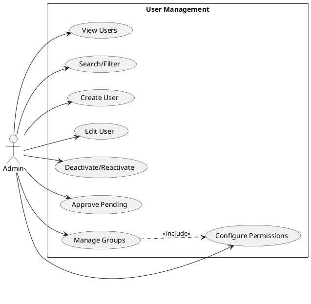

**UC-3.2.2: Activate/Deactivate Users**

- Actor: Administrator
- Main Flow:
  1. Admin views user list
  2. Admin selects user to activate or deactivate
  3. Admin changes user status
  4. System updates user status immediately
  5. User's access is granted or revoked accordingly

**UC-3.2.3: Manage User Groups**

- Actor: Administrator
- Main Flow:
  1. Admin navigates to Group Management
  2. Admin creates/edits user groups
  3. Admin configures permissions for group
  4. System saves group configuration
  5. Users assigned to group inherit permissions

**Functional Requirements:**

**FR-3.2.1**: The system SHALL allow administrators to view all user accounts in a searchable, filterable list.

- Display Fields: Username, email, group, status, last login, created date
- Search Capability: By username, email, department
- Filter Options: By status (Active/Pending/Inactive), by group
- Pagination: 20 users per page (configurable)

**FR-3.2.2**: The system SHALL allow administrators to create new user accounts with system-generated passwords.

- Required Fields: Email, username, group assignment (password auto-generated)
- Optional Fields: Department, phone, notes
- Password Display: Show generated password with copy and email options
- Validation: Email format, username uniqueness

**FR-3.2.3**: The system SHALL allow administrators to edit existing user information.

- Editable Fields: Username, group assignment, status, department, contact info
- Protected Fields: Email (cannot be changed), user ID
- Audit Trail: Log all changes with admin ID and timestamp

**FR-3.2.4**: The system SHALL allow administrators to deactivate (not delete) user accounts.

- Deactivation Effect: User cannot login, existing sessions terminated
- Data Preservation: All user transaction history retained
- Reactivation: Admin can reactivate deactivated users

**FR-3.2.5**: The system SHALL allow administrators to change user status between Active, Pending, and Inactive.

- Status Workflow: Pending → Active (approval), Active ↔ Inactive (deactivation/reactivation)
- Immediate Effect: Status change takes effect immediately
- Notification: User informed of status changes

**FR-3.2.6**: The system SHALL allow administrators to reassign users to different groups.

- Group Change: Updates user permissions immediately
- Session Impact: Next login reflects new permissions
- Validation: Ensure target group exists

**FR-3.2.7**: The system SHALL provide user group management functionality (CRUD operations).

- Group Attributes: Group ID, name, description, permissions array
- Predefined Groups: Admin (A), Storekeeper (S), Procurement (P), Maintenance (M)
- Custom Groups: Admin can create additional groups

**FR-3.2.8**: The system SHALL allow administrators to configure granular permissions for each user group.

- Permission Types: Feature access, CRUD operations, data visibility
- Permission Modules: Authentication, User Management, Inventory, Procurement, Maintenance, Reports
- Inheritance: Users inherit all permissions from assigned group

**FR-3.2.9**: The system SHALL display user activity information including last login date/time.

- Activity Tracking: Login times, active sessions, last action
- Usage Statistics: Feature usage frequency, transaction counts
- Session Management: Admin can view active sessions

**FR-3.2.10**: The system SHALL prevent deletion of user accounts with associated transaction history.

- Soft Delete Only: Deactivate instead of delete
- Data Integrity: Preserve referential integrity for audit trail
- Orphan Prevention: Transactions remain linked to original user

**Acceptance Criteria:**

- ✓ Admin can view paginated list of all users
- ✓ Admin can search users by username or email
- ✓ Admin can filter users by status and group
- ✓ Admin can create new user accounts with system-generated passwords
- ✓ Admin can copy generated password or send it via email
- ✓ Admin can edit user details except email
- ✓ Admin can deactivate/reactivate users
- ✓ Admin can reassign users to different groups
- ✓ Admin can create and configure user groups
- ✓ Admin can set granular permissions per group
- ✓ Deactivated user cannot login
- ✓ User permissions update immediately after group change
- ✓ All administrative actions are logged

---

### 3.3 Master Data Management

**Feature Description:**

Master data management provides centralized maintenance of reference data used throughout the system, including parts catalog, suppliers, storage locations, assets, and other organizational data. Accurate master data is essential for effective inventory operations.

**Priority:** HIGH (Critical)

**Use Cases:**

**UC-3.3.1: Manage Parts Master**

- Actor: Admin, Storekeeper (Read-only)
- Main Flow:
  1. User navigates to Parts Master
  2. User views list of all parts
  3. Authorized user can add/edit/delete parts
  4. User enters part specifications
  5. System generates unique part barcode
  6. System saves part record

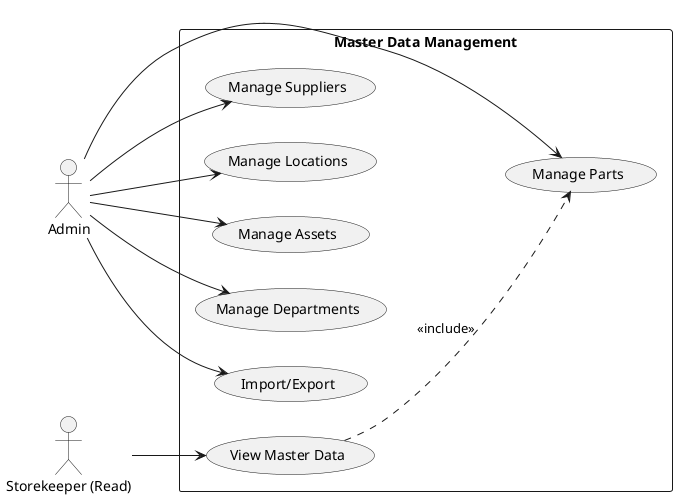

**Functional Requirements:**

**FR-3.3.1**: The system SHALL provide Parts Master management for cataloging all spare parts and materials.

- Part Attributes: Part number (unique), description, specifications, category, unit of measure, reorder level, reorder quantity, standard cost, current price, supplier, barcode
- Barcode Generation: Automatic generation in Code 128 format
- Search/Filter: By part number, description, category, supplier
- Validation: Part number must be unique

**FR-3.3.2**: The system SHALL provide Part Group management for categorizing parts hierarchically.

- Group Attributes: Group ID, name, description, parent group (for hierarchy)
- Hierarchy Levels: Up to 3 levels (e.g., Electrical → Motors → AC Motors)
- Assignment: Each part assigned to one primary group

**FR-3.3.3**: The system SHALL provide Supplier Master management for vendor information.

- Supplier Attributes: Supplier code (unique), name, contact person, address, phone, email, payment terms, currency, lead time, rating
- Search/Filter: By name, code, rating
- Status: Active/Inactive indicator

**FR-3.3.4**: The system SHALL provide Storage Location management for defining inventory storage hierarchy.

- Location Hierarchy: Warehouse → Zone → Bin (3-level structure)
- Location Attributes: Location code (unique), name, parent location, capacity, location type
- Location Path: System generates full path (e.g., WH01-ZONE-A-BIN-001)

**FR-3.3.5**: The system SHALL provide Asset/Machine Master for equipment tracking.

- Asset Attributes: Asset number (unique), description, manufacturer, model, serial number, installation date, department, location, criticality level, maintenance schedule
- Asset Status: Operational, Under Maintenance, Decommissioned
- Maintenance History: Linked to maintenance transactions

**FR-3.3.6**: The system SHALL provide Department Master for organizational structure.

- Department Attributes: Department code (unique), name, manager, cost center
- Department Purpose: Cost allocation, stock requisitions, reporting

**FR-3.3.7**: The system SHALL enforce referential integrity for master data relationships.

- Part-Supplier: Parts can reference suppliers
- Part-Group: Parts must belong to valid group
- Location-Parent: Storage locations must reference valid parent or be root
- Asset-Department: Assets must belong to valid department

**FR-3.3.8**: The system SHALL prevent deletion of master data records referenced by transactional data.

- Soft Delete: Mark as inactive instead of delete
- Validation: Check for dependent records before deletion
- Warning: Display warning if record has dependencies

**FR-3.3.9**: The system SHALL provide import/export functionality for bulk master data updates.

- Format: CSV file format
- Templates: Downloadable templates with proper format
- Validation: Verify data format and business rules during import
- Error Reporting: List of validation failures after import attempt

**FR-3.3.10**: The system SHALL maintain audit trail for all master data changes.

- Tracked Changes: Create, update, delete operations
- Audit Data: Timestamp, user, old value, new value, change reason
- History View: Display change history for each record

**Acceptance Criteria:**

- ✓ Authorized users can create, view, edit master data records
- ✓ System generates unique barcodes for new parts
- ✓ Part groups support hierarchical categorization
- ✓ Storage locations support 3-level hierarchy
- ✓ System prevents deletion of master data with dependencies
- ✓ Inactive master data cannot be used in new transactions
- ✓ Master data changes are logged with user and timestamp
- ✓ Users can search and filter master data efficiently
- ✓ System enforces unique identifiers (codes/numbers)
- ✓ Import functionality validates data before saving

---

### 3.4 Inventory Operations Management

**Feature Description:**

Inventory operations management handles all transactions that affect inventory quantities, including receipts, issues, transfers, and adjustments. This is the core functionality of SIMS, providing real-time inventory visibility and complete transaction traceability.

**Priority:** HIGH (Critical)

**Use Cases:**

**UC-3.4.1: Stock In Operation**

- Actor: Storekeeper
- Precondition: Valid parts exist in system, supplier registered
- Main Flow:
  1. Storekeeper initiates Stock In transaction
  2. Enters GRN number and supplier
  3. Scans barcode or selects part
  4. Enters quantity and storage location
  5. System updates inventory level
  6. System creates movement log entry
  7. System confirms transaction
- Postcondition: Inventory increased, audit trail created

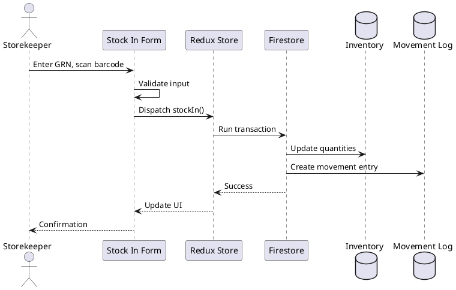

**UC-3.4.2: Stock Out Operation**

- Actor: Storekeeper
- Precondition: Sufficient stock available
- Main Flow:
  1. Storekeeper initiates Stock Out
  2. Selects requesting department
  3. Scans barcode or selects part
  4. Enters quantity to issue
  5. System validates stock availability
  6. System decreases inventory
  7. System creates movement log
- Postcondition: Inventory decreased, parts issued

**UC-3.4.3: Internal Transfer**

- Actor: Storekeeper
- Main Flow:
  1. Storekeeper initiates transfer
  2. Selects part and from-location
  3. Selects to-location
  4. Enters quantity to transfer
  5. System validates sufficient stock at source
  6. System moves quantity between locations
  7. System logs transfer transaction

**UC-3.4.4: Stock Adjustment**

- Actor: Storekeeper (with approval)
- Main Flow:
  1. Storekeeper identifies discrepancy
  2. Initiates adjustment transaction
  3. Enters part, location, adjustment quantity (+ or -)
  4. Enters reason code and notes
  5. System requires supervisor approval for adjustments above threshold
  6. Upon approval, system adjusts inventory
  7. System logs adjustment with full details

**Functional Requirements:**

**FR-3.4.1**: The system SHALL support Stock In transactions with barcode scanning capability.

- Transaction Data: GRN number, supplier, part(s), quantities, unit cost, storage location, received date, received by user
- Barcode Support: Scan part barcode for quick data entry
- Batch Entry: Multiple line items in single transaction
- Inventory Update: Increase inventory at specified location
- Movement Log: Automatic creation of inbound movement record

**FR-3.4.2**: The system SHALL support Stock Out transactions for issuing parts.

- Transaction Data: Issue number, requesting department/person, part(s), quantities, location, issue date, issued by user
- Stock Validation: Verify sufficient quantity available before issue
- Allocation: Reserve stock for specific work orders (optional)
- Inventory Update: Decrease inventory at specified location
- Movement Log: Automatic creation of outbound movement record

**FR-3.4.3**: The system SHALL support Internal Transfer transactions between storage locations.

- Transaction Data: Transfer number, part, from-location, to-location, quantity, transfer date, reason, transferred by user
- Multi-Step: Decrease from source, increase at destination (atomic operation)
- Validation: Sufficient stock at source location
- Movement Log: Two entries (out from source, in to destination)

**FR-3.4.4**: The system SHALL support Stock Adjustment transactions for correcting inventory discrepancies.

- Adjustment Types: Positive (increase), Negative (decrease), Set Balance (absolute)
- Approval Workflow: Adjustments above threshold require supervisor approval
- Reason Codes: Damage, Obsolescence, Count Error, Loss, Found Stock
- Mandatory Fields: Reason code, detailed notes explaining adjustment
- Audit Trail: Full logging including before/after quantities

**FR-3.4.5**: The system SHALL provide Stock Take functionality for physical inventory counting.

- Stock Take Process: Create stock take sheet, conduct counting, process results, adjust discrepancies
- Count Methods: Full count (all locations), Cycle count (specific categories), Spot check (random items)
- Variance Reporting: Comparison of counted vs. system quantities
- Batch Adjustment: Process multiple adjustments from stock take results

**FR-3.4.6**: The system SHALL provide Cycle Counting functionality for continuous inventory verification.

- Count Schedule: Configure which items to count (ABC classification, criticality)
- Count Frequency: Daily, weekly, monthly cycles
- Count Assignment: Assign count tasks to storekeepers
- Variance Threshold: Acceptable variance levels before investigation

**FR-3.4.7**: The system SHALL provide comprehensive Movement Log showing all inventory transactions.

- Log Entries: All stock in, stock out, transfers, adjustments with full details
- Log Data: Transaction type, date/time, part, location, quantity, user, reference document
- Search/Filter: By date range, part, location, transaction type, user
- Export: CSV or PDF export for external analysis

**FR-3.4.8**: The system SHALL support receiving items against Purchase Orders.

- PO Lookup: View open POs and pending items
- Partial Receipt: Receive portion of PO line items
- GRN Generation: Create Goods Receipt Note linked to PO
- Quality Check: Optional quality inspection step before final receipt
- Variance Handling: Process over/under deliveries with variance codes

**FR-3.4.9**: The system SHALL validate stock availability before allowing Stock Out transactions.

- Real-time Check: Query current inventory at time of transaction
- Location-Specific: Check stock at specified location
- Reservation: Consider reserved stock as unavailable
- Warning: Allow override with authorization for negative stock

**FR-3.4.10**: The system SHALL update inventory levels in real-time across all user sessions.

- Real-time Sync: Use Firebase real-time listeners for instant updates
- Optimistic Locking: Prevent concurrent update conflicts
- Notification: Alert users when inventory levels change
- Dashboard Refresh: KPIs update automatically

**FR-3.4.11**: The system SHALL generate low stock alerts when inventory falls below reorder level.

- Alert Criteria: Current quantity < reorder level
- Alert Display: Dashboard notification, report listing
- Alert Priority: Based on part criticality
- Alert Actions: Create purchase requisition, notify procurement

**FR-3.4.12**: The system SHALL calculate and display total inventory quantity across all locations for each part.

- Aggregation: Sum quantities from all storage locations
- Real-time Calculation: Update total when any location quantity changes
- Display: Show total on part master and inquiry screens

**FR-3.4.13**: The system SHALL maintain complete audit trail for all inventory transactions.

- Audit Data: Who, what, when, where, why, quantity before/after
- Immutability: Transaction records cannot be edited, only reversed
- Retention: Permanent retention per compliance requirements
- Access: Audit logs accessible by admin and auditors

**Acceptance Criteria:**

- ✓ Storekeeper can perform stock in with GRN reference
- ✓ Barcode scanning populates part information automatically
- ✓ System prevents stock out if insufficient quantity available
- ✓ Internal transfers update both source and destination locations atomically
- ✓ Stock adjustments require reason code and notes
- ✓ Large adjustments trigger approval workflow
- ✓ Stock take process identifies and processes variances
- ✓ Cycle counting supports configurable schedules
- ✓ Movement log displays all transactions with filter capability
- ✓ Inventory levels update in real-time for all users
- ✓ Low stock alerts appear when quantity drops below reorder level
- ✓ System calculates total stock across all locations
- ✓ All transactions create immutable audit trail entries
- ✓ System prevents deletion of inventory transactions

---

### 3.5 Procurement Management System

**Feature Description:**

The procurement management system streamlines the purchasing process from requisition creation through purchase order management. It provides workflow automation, approval routing, and supplier coordination capabilities to ensure timely and cost-effective procurement of inventory items.

**Priority:** HIGH (Critical)

**Use Cases:**

**UC-3.5.1: Create Purchase Requisition**

- Actor: Storekeeper, Procurement Officer
- Main Flow:
  1. User identifies need to replenish stock
  2. Creates purchase requisition
  3. Adds parts and quantities needed
  4. Suggests supplier
  5. Submits for approval
  6. System routes through approval workflow
  7. Approved PR converts to PO

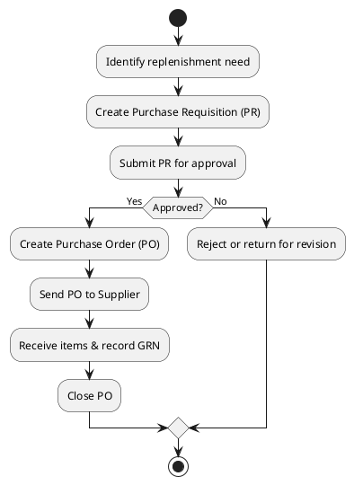

**UC-3.5.2: Create Purchase Order**

- Actor: Procurement Officer
- Main Flow:
  1. Reviews approved requisitions
  2. Consolidates requisitions by supplier
  3. Creates purchase order
  4. Enters pricing and terms
  5. Sends PO to supplier
  6. Tracks PO status until receipt

**Functional Requirements:**

**FR-3.5.1**: The system SHALL allow authorized users to create Purchase Requisitions.

- PR Data: PR number (auto-generated), requested by, date, required date, priority, status
- Line Items: Part, quantity, estimated cost, reason for request
- Supplier Suggestion: Recommend supplier based on part master
- Status Values: Draft, Submitted, Under Review, Approved, Rejected, Converted to PO

**FR-3.5.2**: The system SHALL implement multi-level approval workflow for Purchase Requisitions.

- Approval Levels: Configurable (default: Requester → Supervisor → Procurement)
- Approval Authority: Based on PR total value thresholds
- Workflow Actions: Approve, Reject, Request More Info, Return to Requester
- Notification: Email notification at each workflow step (when implemented)

**FR-3.5.3**: The system SHALL allow procurement officers to create Purchase Orders from approved requisitions.

- PO Data: PO number (auto-generated), supplier, date, delivery date, payment terms, shipping address, total value
- PO Line Items: Part, description, quantity, unit price, line total
- PR Linkage: Reference source PR numbers
- Tax Calculation: Compute tax if applicable

**FR-3.5.4**: The system SHALL allow procurement officers to create Purchase Orders directly (without PR).

- Direct PO: For emergency purchases or consumables
- Same Data Structure: Equivalent fields to PR-originated POs
- Approval: May require approval based on value threshold

**FR-3.5.5**: The system SHALL track Purchase Order status through lifecycle.

- PO Status: Draft, Issued, Acknowledged, Partially Received, Fully Received, Cancelled, Closed
- Status Transitions: Automatic on certain events (e.g., full receipt → Fully Received)
- Supplier Acknowledgment: Option to record supplier confirmation

**FR-3.5.6**: The system SHALL provide Purchase Order tracking and monitoring capabilities.

- Open PO List: Display all POs not fully received
- Overdue Tracking: Highlight POs past expected delivery date
- Receipt Status: Show received vs. ordered quantities
- Supplier Performance: Track on-time delivery rate

**FR-3.5.7**: The system SHALL provide Critical Spares management functionality.

- Critical List: Maintain list of critical parts
- Criticality Levels: Critical, Essential, Normal
- Minimum Stock: Enforced minimum quantities for critical items
- Alert Priority: Higher priority alerts for critical spares
- Supplier Contracts: Preferred suppliers for critical items

**FR-3.5.8**: The system SHALL provide Requisition Dashboard for centralized monitoring.

- Dashboard Metrics: Open PRs, pending approvals, approved awaiting PO, overdue items
- My Tasks: PRs requiring user's approval
- Status Filters: Filter by status, priority, date range
- Drill-Down: Click to view PR details

**FR-3.5.9**: The system SHALL generate low stock alerts and suggest reorder quantities.

- Alert Trigger: Quantity below reorder level
- Suggested Quantity: Reorder quantity from part master (adjustable)
- Quick PR Creation: One-click PR creation from alert
- Bulk PR: Create PR for multiple low-stock items

**FR-3.5.10**: The system SHALL track supplier performance metrics.

- Metrics: On-time delivery %, quality rating, lead time average, price competitiveness
- Rating: Star rating or score
- History: Historical performance data
- Supplier Comparison: Compare metrics across suppliers

**Acceptance Criteria:**

- ✓ User can create purchase requisitions with multiple line items
- ✓ Requisitions route through approval workflow automatically
- ✓ Approvers see pending requisitions requiring their action
- ✓ Approved requisitions can be converted to purchase orders
- ✓ Procurement can create POs directly without PR
- ✓ PO status updates automatically based on receipts
- ✓ Requisition dashboard shows accurate metrics
- ✓ Critical spares are flagged and prioritized
- ✓ Low stock alerts list parts needing replenishment
- ✓ System tracks supplier performance metrics
- ✓ Users can view all open POs and their status
- ✓ System prevents duplicate PO creation for same PR

---

### 3.6 Maintenance Management Integration

**Feature Description:**

The maintenance management integration connects inventory operations with maintenance activities, enabling maintenance technicians to request parts, link parts consumption to work orders, and track machine history. This integration ensures parts availability for maintenance work and provides visibility into maintenance-related inventory consumption.

**Priority:** MEDIUM

**Use Cases:**

**UC-3.6.1: Submit Material Request Form**

- Actor: Maintenance Technician
- Main Flow:
  1. Technician identifies parts needed for maintenance
  2. Creates Material Request Form (MRF)
  3. Selects parts and quantities
  4. Specifies machine/work order
  5. Submits MRF to storekeeper
  6. Storekeeper reviews and issues parts
  7. Technician confirms receipt

**UC-3.6.2: Record Machine History**

- Actor: Maintenance Technician
- Main Flow:
  1. Technician completes maintenance work
  2. Records maintenance activity in machine history
  3. Links parts consumed during maintenance
  4. Documents work performed
  5. System updates machine history log

**Functional Requirements:**

**FR-3.6.1**: The system SHALL allow maintenance technicians to create Material Request Forms (MRFs).

- MRF Data: MRF number (auto-generated), requesting technician, date, required date, priority, machine/asset, work order reference
- Line Items: Part, requested quantity, reason
- Status: Draft, Submitted, Under Review, Approved, Issued, Completed, Cancelled

**FR-3.6.2**: The system SHALL allow storekeepers to process and fulfill MRFs.

- Processing: Review MRF, check stock availability
- Partial Issue: Issue available quantity if stock insufficient
- Backorder: Track unfulfilled quantities
- Issue Transaction: Creates stock out transaction linked to MRF

**FR-3.6.3**: The system SHALL allow parts to be issued against work orders.

- Work Order Linkage: Associate stock out with specific work order
- Cost Allocation: Track parts cost by work order
- Work Order Status: View parts issued to each work order

**FR-3.6.4**: The system SHALL provide Machine History functionality for tracking maintenance and parts consumption by asset.

- History Entry: Date, machine/asset, maintenance type, technician, work description, parts used, labor hours, completion status
- Parts Linkage: Link to stock out transactions
- Maintenance Schedule: Planned vs. actual maintenance
- History View: Chronological log of all maintenance events per asset

**FR-3.6.5**: The system SHALL provide maintenance dashboard for technicians.

- Dashboard Metrics: Pending MRFs, parts availability for scheduled maintenance, overdue maintenance activities
- My Requests: MRFs created by logged-in technician
- Stock Availability: Check part availability before creating MRF

**FR-3.6.6**: The system SHALL alert storekeepers of pending MRFs requiring attention.

- Alert Display: Dashboard notification of new/urgent MRFs
- Priority Handling: Critical machine MRFs highlighted
- SLA Tracking: Time since MRF submission

**Acceptance Criteria:**

- ✓ Maintenance technician can create MRF with multiple line items
- ✓ Storekeeper sees pending MRFs in dashboard
- ✓ Storekeeper can issue parts against MRF
- ✓ Partial issues are tracked with backorder quantity
- ✓ Parts issued to work orders are tracked separately
- ✓ Machine history log displays all maintenance events
- ✓ Parts consumption linkable to machine history entries
- ✓ Maintenance dashboard shows accurate pending requests
- ✓ Critical machine requests are prioritized visually
- ✓ Technician can view status of submitted MRFs

---

### 3.7 Reporting and Analytics System

**Feature Description:**

The reporting and analytics system provides comprehensive visibility into inventory levels, movements, valuations, and key performance indicators. Reports support operational decision-making, compliance requirements, and continuous improvement initiatives.

**Priority:** MEDIUM

**Use Cases:**

**UC-3.7.1: View KPI Dashboard**

- Actor: All Users (per permissions)
- Main Flow:
  1. User navigates to dashboard
  2. System displays real-time KPIs
  3. User views inventory value, movement counts, alerts
  4. User can click metrics for detailed views

**UC-3.7.2: Generate Stock Valuation Report**

- Actor: Admin, Management
- Main Flow:
  1. User navigates to Stock Valuation report
  2. Selects valuation date and method
  3. System calculates inventory value
  4. Report displays by part, category, location
  5. User exports report to PDF or CSV

**Functional Requirements:**

**FR-3.7.1**: The system SHALL provide KPI Dashboard with real-time inventory metrics.

- KPIs Displayed: Total inventory value, total parts count, low stock items count, today's movements (in/out), pending requisitions, pending MRFs
- Real-time Updates: Metrics update automatically when data changes
- Date Range: Configurable time period for movement metrics
- Role-Based: Display KPIs relevant to user role

**FR-3.7.2**: The system SHALL provide Stock Inquiry report for current inventory levels.

- Search Capability: By part number, description, category, supplier, location
- Display Columns: Part number, description, unit, total quantity, quantity by location, reorder level, last movement date
- Sorting: By any column
- Export: CSV or PDF format

**FR-3.7.3**: The system SHALL provide Stock Valuation report calculating total inventory value.

- Valuation Methods: Average Cost, FIFO (Future), Last Purchase Price, Standard Cost
- Grouping: By part category, supplier, storage location
- Date Selection: Valuation as of specific date
- Drill-Down: Click category to see individual parts
- Export: CSV or PDF with summary and details

**FR-3.7.4**: The system SHALL provide Movement History report for transaction analysis.

- Filter Options: Date range, part, location, transaction type (In/Out/Transfer/Adjustment), user
- Display Data: Transaction date, type, part, location, quantity, user, reference document
- Summary: Total in, total out, net movement
- Export: CSV for external analysis

**FR-3.7.5**: The system SHALL provide Low Stock report identifying parts needing replenishment.

- Report Criteria: Parts where current quantity < reorder level
- Display: Part number, description, current quantity, reorder level, reorder quantity, supplier, last purchase date
- Priority: Sorted by criticality or shortage severity
- Action: Direct link to create purchase requisition

**FR-3.7.6**: The system SHALL provide Supplier Performance report analyzing vendor metrics.

- Metrics: On-time delivery percentage, average lead time, order count, total purchase value, quality rating
- Time Period: Selectable date range
- Comparison: Compare multiple suppliers side-by-side
- Export: PDF format with charts

**FR-3.7.7**: The system SHALL support custom date range selection for all reports.

- Date Picker: Start date and end date selection
- Preset Ranges: Today, This Week, This Month, Last Month, This Quarter, This Year, Custom
- Validation: End date must be after start date

**FR-3.7.8**: The system SHALL support exporting reports to CSV and PDF formats.

- CSV Export: All data columns, suitable for Excel analysis
- PDF Export: Formatted report with headers, footers, page numbers, company logo placeholder
- Large Reports: Handle large datasets without timeout (pagination if needed)

**FR-3.7.9**: The system SHALL display report generation date/time and user who generated report.

- Report Metadata: Generated by [username], Generated on [date time], Report parameters used
- Footer: Display on printed/exported reports

**FR-3.7.10**: The system SHALL provide print-friendly formatting for all reports.

- Print Layout: Optimized for A4/Letter paper
- Page Breaks: Intelligent breaks between sections
- Headers/Footers: Company name, report title, page numbers
- Print Preview: Before actual printing

**Acceptance Criteria:**

- ✓ Dashboard displays accurate real-time KPIs
- ✓ Stock Inquiry report shows current inventory across all locations
- ✓ Stock Valuation report calculates correct values
- ✓ Movement History report filters and displays transactions correctly
- ✓ Low Stock report identifies parts below reorder level
- ✓ Supplier Performance report shows accurate metrics
- ✓ All reports support date range filtering
- ✓ Reports export to CSV with all data
- ✓ Reports export to PDF with proper formatting
- ✓ Generated reports include metadata (date, user, parameters)
- ✓ Reports are print-friendly with proper page breaks

---

## 4. External Interface Requirements

### 4.1 User Interfaces

**General UI Requirements:**

The SIMS user interface follows modern web application design principles with responsive layout,consistent styling, and intuitive navigation.

**UI-1: Layout Structure**

- **Header Bar**: Contains application logo, system name, user info, and logout button
- **Sidebar Navigation**: Collapsible menu with role-based feature access
- **Main Content Area**: Dynamic content based on selected feature
- **Footer**: Copyright information and version number

**UI-2: Navigation**

- **Primary Navigation**: Sidebar menu organized by functional modules
- **Breadcrumb Navigation**: Display current location in application hierarchy
- **Back Button**: Browser back button supported, maintains navigation state

**UI-3: Common Components**

- **Data Tables**: Paginated tables with sort, filter, and search capabilities
- **Forms**: Consistent input fields, labels, validation messages, submit/cancel buttons
- **Modals**: Pop-up dialogs for data entry, confirmations, and notifications
- **Alerts/Notifications**: Toast messages for success, error, warning, and information
- **Loading Indicators**: Spinners during data loading operations

**UI-4: Responsive Design**

- **Desktop**: Optimized for screens ≥1366x768 pixels
- **Tablet**: Responsive layout for screens 768-1365 pixels
- **Mobile**: Basic functionality (future enhancement)

**UI-5: Accessibility**

- **Keyboard Navigation**: Tab order follows logical flow
- **Form Labels**: Associated with input fields
- **Error Messages**: Clear, specific, and actionable
- **Color Contrast**: Meets WCAG 2.0 Level AA standards (target)

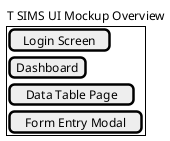

- Login screen mockup
- Dashboard mockup
- Data table page mockup
- Form entry modal mockup

**Key Screens:**

1. **Login Screen**: Email and password fields, "Forgot Password" link
2. **Dashboard**: KPI cards, recent activity widgets, quick action buttons, alerts panel
3. **Master Data Screens**: List view with CRUD buttons, search bar, filter dropdowns
4. **Transaction Screens**: Form with part selection, barcode scan field, quantity input, location selector
5. **Report Screens**: Filter panel, data display (table/charts), export buttons

### 4.2 Hardware Interfaces

**HW-1: Barcode Scanner Interface**

- **Connection Types**: USB (HID device) or Bluetooth
- **Scanner Mode**: Keyboard emulation (simulates keyboard input)
- **Data Format**: Barcode value followed by Enter key
- **Supported Barcodes**: Code 128, EAN-13, QR Code
- **Integration**: System treats scanner input as keyboard entry in designated fields

**HW-2: Label Printer Interface (Optional)**

- **Purpose**: Print barcode labels for parts
- **Connection**: USB or network-connected
- **Format**: Browser print function, no custom driver required
- **Label Size**: Configurable (common sizes: 50mm x 25mm)

**HW-3: Client Device Specifications**

- **Desktop/Laptop**: Intel Core i3 or equivalent, 4GB RAM, modern GPU for smooth rendering
- **Tablet**: 10-inch screen minimum, 2GB RAM, touch-enabled
- **Display**: Minimum 1366x768 resolution, recommended 1920x1080

### 4.3 Software Interfaces

**Firebase Authentication Interface:**

- **Service**: Firebase Authentication REST API
- **Protocol**: HTTPS
- **Authentication Methods**: Email/Password
- **Token Format**: JWT (JSON Web Token)
- **Session Management**: Token refresh, expiration handling
- **API Endpoints**: SignUp, SignIn, SignOut, PasswordReset, ChangePassword

**Cloud Firestore Interface:**

- **Service**: Firebase Firestore NoSQL Database
- **Protocol**: HTTPS, WebSocket (real-time listeners)
- **Data Format**: JSON documents
- **Operations**: CRUD (Create, Read, Update, Delete), Queries, Transactions
- **Security**: Firestore Security Rules enforce access control
- **Collections**: users, groups, parts, suppliers, inventory, movements, requisitions, orders, reports

**Firebase Hosting Interface:**

- **Service**: Firebase Hosting CDN
- **Protocol**: HTTPS
- **Deployment**: Firebase CLI deployment
- **Asset Serving**: Static files (HTML, CSS, JS, images)
- **Custom Domain**: Support for custom domain mapping

**React Framework:**

- **Version**: React 18.3.1
- **State Management**: Redux Toolkit 2.10.1
- **UI Library**: Material-UI 7.3.5
- **Routing**: React Router v6

**Browser APIs:**

- **LocalStorage**: Session persistence, user preferences
- **SessionStorage**: Temporary data within browser session
- **Geolocation** (Future): Location tracking for mobile
- **Camera API** (Future): Barcode scanning via camera

### 4.4 Communication Interfaces

**COMM-1: HTTPS Protocol**

- **Encryption**: TLS 1.2 or higher
- **Certificate**: Firebase-managed SSL certificates
- **Ports**: Port 443 (HTTPS)

**COMM-2: WebSocket Connection**

- **Purpose**: Real-time data synchronization (Firestore listeners)
- **Protocol**: WSS (WebSocket Secure)
- **Reconnection**: Automatic reconnection on connection loss

**COMM-3: Data Formats**

- **Request/Response**: JSON format
- **Date/Time**: ISO 8601 format
- **Numbers**: Decimal notation, no scientific notation
- **Text Encoding**: UTF-8

**COMM-4: Network Requirements**

- **Bandwidth**: Minimum 5 Mbps recommended
- **Latency**: <200ms for optimal real-time updates
- **Firewall**: Allow outbound HTTPS to Firebase domains

**COMM-5: API Rate Limiting**

- **Firebase Quotas**: Subject to Firebase plan limits
- **Read Operations**: Managed within quota
- **Write Operations**: Batched where possible to minimize writes
- **Real-time Connections**: Limited concurrent connections per plan

---

## 5. System Architecture and Design

### 5.1 System Architecture Overview

SIMS follows a three-tier architecture with clear separation of concerns:

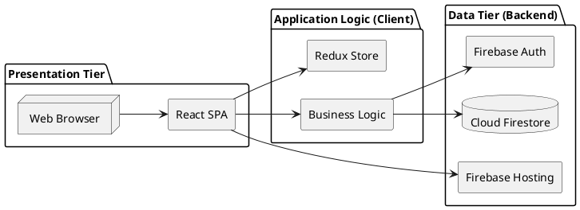

**Presentation Tier (Client):**

- React-based Single Page Application (SPA)
- Redux Toolkit for state management
- Material-UI component library
- Runs entirely in user's web browser

**Application Logic Tier (Client-Side):**

- Business logic implemented in React components
- Redux thunks for asynchronous operations
- Validation and data transformation
- Client-side routing with React Router

**Data Tier (Backend):**

- Firebase Authentication for user identity
- Cloud Firestore for persistent data storage
- Firebase Security Rules for access control
- Firebase Hosting for application delivery

**Architecture Characteristics:**

- **Client-Heavy**: Most logic executes in browser
- **Serverless**: No custom server infrastructure
- **Real-Time**: WebSocket connections for live data updates
- **Stateless Backend**: Firebase services handle state persistence

### 5.2 Technology Stack

**Frontend Technologies:**

| Component        | Technology        | Version | Purpose                          |
| ---------------- | ----------------- | ------- | -------------------------------- |
| Framework        | React             | 18.3.1  | UI component framework           |
| State Management | Redux Toolkit     | 2.10.1  | Centralized state management     |
| UI Library       | Material-UI (MUI) | 7.3.5   | Pre-built UI components          |
| Routing          | React Router      | 6.x     | Client-side navigation           |
| Form Handling    | React Hook Form   | 7.x     | Form validation and submission   |
| Date Handling    | date-fns          | 2.x     | Date formatting and manipulation |
| Charts           | Recharts          | 2.x     | Data visualization               |
| HTTP Client      | Axios / Fetch     | Native  | API communication                |

**Backend Services:**

| Service        | Provider                 | Purpose                     |
| -------------- | ------------------------ | --------------------------- |
| Authentication | Firebase Auth            | User identity management    |
| Database       | Cloud Firestore          | NoSQL document database     |
| Hosting        | Firebase Hosting         | Static file hosting and CDN |
| Functions      | Cloud Functions (Future) | Serverless backend logic    |
| Storage        | Cloud Storage (Future)   | File uploads                |

**Development Tools:**

| Tool            | Purpose                        |
| --------------- | ------------------------------ |
| Node.js         | Development environment        |
| npm             | Package management             |
| Firebase CLI    | Firebase service management    |
| Git             | Version control                |
| VS Code         | Code editor (recommended)      |
| Chrome DevTools | Debugging and profiling        |
| Redux DevTools  | State inspection and debugging |

**Build and Deployment:**

| Tool             | Purpose                               |
| ---------------- | ------------------------------------- |
| Create React App | Project scaffolding and build scripts |
| Webpack          | Module bundling (via CRA)             |
| Babel            | JavaScript transpilation (via CRA)    |
| Firebase CLI     | Deployment to Firebase Hosting        |

### 5.3 Database Design

**Database Type:** Cloud Firestore (NoSQL Document Database)

**Data Model Overview:**

Firestore organizes data into collections and documents. Each document contains fields (key-value pairs) and may reference other documents.

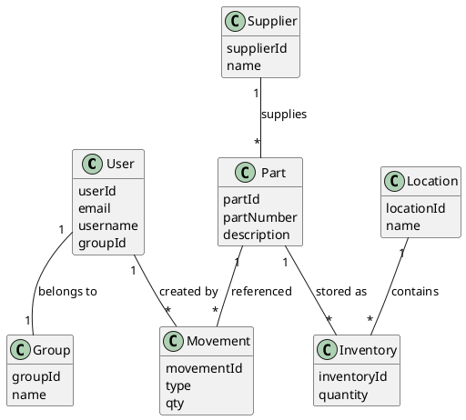

**Key Collections:**

**1. users Collection**

```
users/{userId}
  - uid: string (unique)
  - email: string
  - username: string
  - groupId: string (references groups)
  - department: string
  - status: string (Active|Pending|Inactive)
  - createdAt: timestamp
  - lastLogin: timestamp
  - passwordHistory: array
```

**2. groups Collection**

```
groups/{groupId}
  - groupId: string (A|S|P|M)
  - name: string
  - description: string
  - permissions: object {
      canAccessUserManagement: boolean
      canAccessInventory: boolean
      canAccessProcurement: boolean
      ...
    }
  - createdAt: timestamp
  - updatedAt: timestamp
```

**3. parts Collection**

```
parts/{partId}
  - partNumber: string (unique)
  - description: string
  - specifications: string
  - categoryId: string (references partGroups)
  - unitOfMeasure: string
  - reorderLevel: number
  - reorderQuantity: number
  - standardCost: number
  - currentPrice: number
  - supplierId: string (references suppliers)
  - barcode: string
  - status: string (Active|Inactive)
  - createdAt: timestamp
  - updatedAt: timestamp
```

**4. inventory Collection**

```
inventory/{inventoryId}
  - partId: string (references parts)
  - locationId: string (references storageLocations)
  - quantity: number
  - reservedQuantity: number
  - lastMovementDate: timestamp
  - lastCountDate: timestamp
  - updatedAt: timestamp
```

**5. movements Collection (Audit Trail)**

```
movements/{movementId}
  - movementNumber: string (unique)
  - movementType: string (StockIn|StockOut|Transfer|Adjustment)
  - partId: string
  - locationId: string
  - quantity: number
  - quantityBefore: number
  - quantityAfter: number
  - referenceDocument: string
  - reason: string
  - userId: string (references users)
  - timestamp: timestamp
  - metadata: object
```

**6. purchaseRequisitions Collection**

```
purchaseRequisitions/{prId}
  - prNumber: string (unique)
  - requestedBy: string (userId)
  - requestDate: timestamp
  - requiredDate: timestamp
  - priority: string (High|Medium|Low)
  - status: string (Draft|Submitted|Approved|Rejected|ConvertedToPO)
  - lineItems: array [{
      partId: string
      quantity: number
      estimatedCost: number
      reason: string
    }]
  - approvalHistory: array
  - createdAt: timestamp
  - updatedAt: timestamp
```

**7. purchaseOrders Collection**

```
purchaseOrders/{poId}
  - poNumber: string (unique)
  - supplierId: string (references suppliers)
  - orderDate: timestamp
  - deliveryDate: timestamp
  - paymentTerms: string
  - status: string (Draft|Issued|PartiallyReceived|FullyReceived|Cancelled)
  - lineItems: array [{
      partId: string
      description: string
      quantity: number
      unitPrice: number
      receivedQuantity: number
    }]
  - totalValue: number
  - prReferences: array (PR numbers)
  - createdBy: string (userId)
  - createdAt: timestamp
  - updatedAt: timestamp
```

**Database Design Principles:**

1. **Denormalization**: Some data duplicated for query performance (e.g., part descriptions in movement logs)
2. **Atomic Operations**: Firestore transactions ensure inventory quantity updates are atomic
3. **Real-Time Listeners**: Key collections have listeners for instant UI updates
4. **Indexing**: Composite indexes created for common query patterns
5. **Data Validation**: Enforced through Firestore Security Rules and client-side validation

**Firestore Security Rules Overview:**

Rules enforce access control at database level:

- Users can only read their own user document
- Admins can read/write all users and groups
- Storekeepers can read parts, write inventory transactions
- Procurement can read/write requisitions and orders
- All writes log user ID and timestamp

### 5.4 Component Architecture

**Frontend Component Hierarchy:**

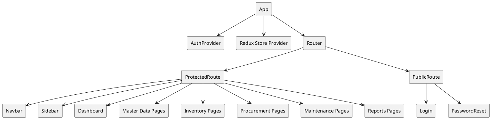

**Top-Level Structure:**

```
App
├── AuthProvider (Authentication context)
├── Redux Store Provider
└── Router
    ├── ProtectedRoute (Requires authentication)
    │   ├── Navbar (Top navigation bar)
    │   ├── Sidebar (Side navigation menu)
    │   └── Main Content Area
    │       ├── Dashboard
    │       ├── Master Data Pages
    │       ├── Inventory Pages
    │       ├── Procurement Pages
    │       ├── Maintenance Pages
    │       └── Reports Pages
    └── PublicRoute (No authentication required)
        ├── Login
        └── PasswordReset
```

**Key Components:**

**1. ProtectedRoute Component**

- **Purpose**: Enforce authentication and authorization
- **Logic**: Check user logged in and has permission for route
- **Redirect**: To login if not authenticated, to forbidden if unauthorized

**2. DataTable Component**

- **Purpose**: Reusable table for displaying lists
- **Features**: Sorting, filtering, pagination, row selection
- **Props**: Columns definition, data array, action buttons

**3. ModalForm Component**

- **Purpose**: Pop-up forms for data entry
- **Features**: Validation, submit/cancel, loading state
- **Variants**: Add new, edit existing, view details

**4. BarcodeScanner Component**

- **Purpose**: Capture barcode input
- **Features**: Keyboard input listener, trigger on Enter key
- **Integration**: Populate form fields automatically

**Redux State Structure:**

```
{
  auth: {
    user: {},
    loading: boolean,
    error: string
  },
  parts: {
    items: [],
    loading: boolean,
    error: string
  },
  inventory: {
    items: [],
    loading: boolean,
    error: string
  },
  requisitions: {
    items: [],
    loading: boolean,
    error: string
  },
  ...
}
```

**State Management Patterns:**

- **Async Operations**: Redux Toolkit createAsyncThunk for Firebase calls
- **Loading States**: Track pending/fulfilled/rejected for each async action
- **Error Handling**: Centralized error handling in Redux middleware
- **Data Normalization**: Normalize nested data for efficient updates

---

## 6. Nonfunctional Requirements

### 6.1 Performance Requirements

**PERF-1: Page Load Time**

- **Requirement**: Initial page load completes within 3 seconds on broadband connection (10 Mbps)
- **Measurement**: Time from navigation to interactive page
- **Optimization**: Code splitting, lazy loading, asset compression

**PERF-2: Transaction Processing Time**

- **Requirement**: Inventory transactions (stock in/out) process and update UI within 2 seconds
- **Measurement**: Time from form submission to success confirmation
- **Target**: 95% of transactions under 2 seconds

**PERF-3: Real-Time Data Updates**

- **Requirement**: Data changes reflected in other user sessions within 5 seconds
- **Measurement**: Time from write to display update in concurrent session
- **Mechanism**: Firestore real-time listeners

**PERF-4: Report Generation Time**

- **Requirement**: Reports with up to 10,000 records generate within 10 seconds
- **Large Reports**: Implement pagination or background processing for >10,000 records
- **Export**: CSV exports for large datasets

**PERF-5: Concurrent Users**

- **Requirement**: System supports up to 50 concurrent users without performance degradation
- **Scaling**: Firebase infrastructure auto-scales
- **Testing**: Load testing with simulated users

**PERF-6: Search and Filter Response**

- **Requirement**: Search and filter operations return results within 1 second
- **Optimization**: Firestore composite indexes, client-side filtering for small datasets

### 6.2 Security Requirements

**SEC-1: Authentication**

- **Requirement**: All system access requires valid authentication
- **Method**: Firebase Authentication with email/password
- **Session**: Token-based with secure storage and automatic expiration

**SEC-2: Authorization**

- **Requirement**: Role-based access control enforces feature-level permissions
- **Enforcement**: Both client-side (UI) and server-side (Firestore rules)
- **Granularity**: Per-module and per-action permissions

**SEC-3: Data Transmission**

- **Requirement**: All data transmitted over HTTPS with TLS 1.2 or higher
- **Certificate**: Managed by Firebase (automatic renewal)

**SEC-4: Password Security**

- **Complexity**: Minimum 8 characters, mixed case, numbers
- **Storage**: Firebase-managed hashing (bcrypt)
- **Reset**: Secure email-based reset with time-limited tokens

**SEC-5: Data Access Control**

- **Requirement**: Firestore Security Rules prevent unauthorized data access
- **Rules**: Users can only access data permitted by their role
- **Validation**: Rules validate data format and business rules

**SEC-6: Audit Trail**

- **Requirement**: All transactions logged with user ID, timestamp, and action
- **Immutability**: Audit logs cannot be modified or deleted
- **Retention**: Permanent retention (or per organizational policy)

**SEC-7: Session Management**

- **Timeout**: Automatic logout after 8 hours of inactivity
- **Concurrent**: Multiple sessions allowed per user
- **Logout**: Secure logout invalidates client-side token

**SEC-8: Input Validation**

- **Requirement**: All user inputs validated for format, type, and range
- **Locations**: Client-side (immediate feedback) and server-side (security)
- **Sanitization**: Prevent XSS and injection attacks

### 6.3 Software Quality Attributes

**6.3.1 Reliability**

- **Uptime**: Target 99.5% availability (leveraging Firebase SLA)
- **Error Handling**: Graceful error handling with user-friendly messages
- **Data Integrity**: Transactions ensure atomic updates
- **Backup**: Regular Firestore exports for disaster recovery

**6.3.2 Usability**

- **Learnability**: New users productive within 1 day of training
- **Efficiency**: Experienced users complete common tasks in minimal steps
- **Error Prevention**: Validation prevents user errors
- **Help**: Contextual help and tooltips available

**6.3.3 Maintainability**

- **Code Organization**: Modular components, clear separation of concerns
- **Documentation**: Inline code comments, README files, technical docs
- **Coding Standards**: Consistent style (ESLint, Prettier)
- **Version Control**: Git with meaningful commit messages

**6.3.4 Scalability**

- **Data Volume**: Designed to handle 100,000+ parts, 1 million+ transactions
- **Users**: Support growth from 10 to 100 users without redesign
- **Firebase**: Leverages Firebase auto-scaling infrastructure

**6.3.5 Availability**

- **Service Hours**: 24/7 availability (no planned downtime)
- **Disaster Recovery**: Firestore multi-region replication
- **Maintenance**: Zero-downtime deployments (new version while old runs)

**6.3.6 Portability**

- **Browser Compatibility**: Chrome, Edge, Firefox (latest 2 versions)
- **Device Types**: Desktop, laptop, tablet
- **OS Independence**: Platform-agnostic (web-based)

### 6.4 Business Rules

**BR-1: Inventory Quantity Rules**

- Stock quantity cannot go negative (enforce in validation)
- Adjustments above threshold require supervisor approval
- Reserved stock counts toward total but not available for issue

**BR-2: User Status Rules**

- Only Active users can login
- Pending users await admin approval
- Inactive users cannot login but data preserved

**BR-3: Transaction Approval Rules**

- Purchase requisitions above $X require manager approval (configurable)
- Stock adjustments above Y units require supervisor approval
- Critical spares must maintain minimum stock levels

**BR-4: Data Deletion Rules**

- Master data with dependencies cannot be deleted (soft delete only)
- Transactional data cannot be deleted (immutable for audit)
- User accounts can be deactivated but not deleted

**BR-5: Barcode Uniqueness**

- Each part barcode must be unique system-wide
- Barcode generated automatically if not provided
- Manual barcode entry must be validated for uniqueness

**BR-6: Requisition Workflow Rules**

- Requisition must be approved before converting to PO
- Requester cannot approve own requisition
- Rejected requisitions can be revised and resubmitted

**BR-7: Reorder Logic**

- System alerts when stock falls below reorder level
- Reorder quantity suggested based on part master
- Critical spares trigger immediate alerts

---

## 7. Project Context and Development

### 7.1 Development Methodology

**Agile Scrum Methodology:**

The SIMS project was developed using Agile Scrum methodology over four two-week sprints (8 weeks total).

**Sprint Structure:**

- **Duration**: 2 weeks per sprint
- **Planning**: Sprint planning meeting at start
- **Daily Standups**: 15-minute daily sync meetings
- **Sprint Review**: Demo to stakeholders at sprint end
- **Sprint Retrospective**: Team reflection and improvement identification

**Sprint Breakdown:**

**Sprint 1 (Weeks 1-2): Foundation**

- Deliverables: Authentication system, role-based access control, Firebase setup, project structure
- Focus: Establishing technical foundation and team processes
- Challenges: Technology stack learning curve, team coordination setup

**Sprint 2 (Weeks 3-4): User Management & State Architecture**

- Deliverables: User CRUD, group management, Redux architecture, parts/suppliers master data
- Focus: Building state management infrastructure and core master data
- Challenges: Redux learning curve, complex permission system

**Sprint 3 (Weeks 5-6): Core Inventory Operations**

- Deliverables: Stock in/out/transfer/adjustment, barcode integration, real-time dashboard, movement logs
- Focus: Implementing primary business functionality
- Challenges: Transaction integrity (race conditions), performance optimization

**Sprint 4 (Weeks 7-8): Procurement, Reports, and Polish**

- Deliverables: Purchase requisitions/orders, complete reporting suite, automated testing, deployment
- Focus: Completing remaining features, quality assurance, production readiness
- Challenges: Test implementation, deployment configuration, bug fixes

**Development Practices:**

- Version control with Git (feature branch workflow)
- Code reviews for all pull requests
- Daily commits and pushes
- Documentation updated alongside code

### 7.2 Team Structure and Roles

**Development Team (3 Members):**

**Ammar Ibrahim - Full-Stack Developer & Project Lead (40-45% workload)**

- Role: Technical lead, architect, full-stack development
- Responsibilities:
  - Sprint 1: Authentication system, Firebase configuration, project architecture
  - Sprint 2: Redux architecture, user management, team mentorship
  - Sprint 3: Inventory operations backend, performance optimization, crisis management
  - Sprint 4: Automated testing framework, procurement backend, CI/CD pipeline, deployment
- Leadership: Sprint planning, daily standups, code reviews, technical decisions, team coordination

**Syazwan - Frontend Developer (30-35% workload)**

- Role: Frontend specialist, UI/UX implementation
- Responsibilities:
  - Sprint 1: UI component development, Material-UI integration
  - Sprint 2: User management UI, form components
  - Sprint 3: Dashboard visualizations, responsive design
  - Sprint 4: Reports UI, data visualization (charts), final UI polish
- Expertise: React components, Material-UI, user experience design

**Irfan - Backend Developer & Database Specialist (25-30% workload)**

- Role: Database design, backend logic specialist
- Responsibilities:
  - Sprint 1: Firestore schema design, data modeling
  - Sprint 2: Database operations, API integration
  - Sprint 3: Database optimization, query performance
  - Sprint 4: Procurement data structures, supplier integration, report data aggregation
- Expertise: Firestore operations, data structures, database optimization

**Collaboration Dynamics:**

- Daily standup meetings (10 minutes)
- Weekly sprint planning and retrospectives
- Pair programming for complex features
- Code reviews before merging to main branch
- Shared documentation responsibility

### 7.3 Project Timeline

**Total Duration:** 8 weeks (February 2026)

**Timeline Overview:**

| Sprint   | Dates     | Focus                | Key Deliverables                                |
| -------- | --------- | -------------------- | ----------------------------------------------- |
| Sprint 1 | Weeks 1-2 | Foundation           | Authentication, RBAC, Firebase setup            |
| Sprint 2 | Weeks 3-4 | State & Master Data  | Redux, User/Group management, Parts master      |
| Sprint 3 | Weeks 5-6 | Inventory Operations | Stock transactions, Dashboard, Barcode scanning |
| Sprint 4 | Weeks 7-8 | Completion           | Procurement, Reports, Testing, Deployment       |

**Project Milestones:**

- ✅ Week 2: Authentication system operational
- ✅ Week 4: User management and master data complete
- ✅ Week 6: Core inventory operations functional
- ✅ Week 8: Full system deployed to production

**Current Status (February 4, 2026):**

- Development: 100% complete
- Testing: Manual testing complete, automated tests implemented
- Deployment: Deployed to Firebase Hosting
- Status: Production-ready

### 7.4 Development Tools

**Project Management:**

- **Sagile**: Agile project management tool for sprint planning, task tracking, burndown charts

**Version Control:**

- **Git**: Source code version control
- **GitHub**: Remote repository hosting, collaboration, pull requests

**Development Environment:**

- **VS Code**: Primary code editor
- **Node.js 18+**: Runtime environment
- **npm**: Package management
- **Firebase CLI**: Firebase service management and deployment

**Debugging and Testing:**

- **Chrome DevTools**: Frontend debugging
- **Redux DevTools**: State inspection and debugging
- **React DevTools**: Component hierarchy inspection
- **Jest**: Unit testing framework (Sprint 4)
- **React Testing Library**: Component testing (Sprint 4)

**Code Quality:**

- **ESLint**: JavaScript linting
- **Prettier**: Code formatting
- **Git**: Version control with meaningful commits

**Deployment:**

- **Firebase Hosting**: Production hosting
- **GitHub Actions**: CI/CD pipeline (Sprint 4)
- **Firebase Console**: Backend service management

---

## 8. Other Requirements

### 8.1 Legal and Regulatory Requirements

**Data Privacy:**

- System must comply with applicable data protection regulations (GDPR, local privacy laws)
- User personal information stored securely and accessed only by authorized personnel
- Users have right to access and correct their personal data

**Audit and Compliance:**

- Complete audit trail maintained for all inventory transactions
- Audit logs retained per organizational policy (minimum 7 years recommended)
- System supports compliance reporting for internal and external audits

**Intellectual Property:**

- Source code and documentation property of development team/organization
- Third-party libraries used under appropriate open-source licenses
- System logo and branding subject to trademark protection

**Terms of Use:**

- Users must accept terms of use before accessing system
- Acceptable use policy prohibits misuse of system resources
- Organization retains right to monitor system usage

### 8.2 Internationalization Requirements

**Current State:**

- User interface in English only
- Date formats: Configurable (default: DD/MM/YYYY)
- Number formats: Decimal notation, comma thousands separator
- Currency: Single currency (configured per organization)
- Time Zone: Server time zone (Firebase timezone)

**Future Enhancements:**

- Multi-language support (i18n framework)
- Currency conversion for international suppliers
- Localized date/time formats per user preference
- Multi-currency transaction support

---

## 9. Appendices

### Appendix A: Use Case Diagrams

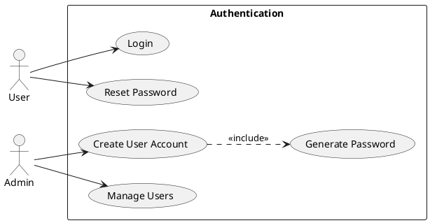

**Description**: Shows actors (User, Admin) and use cases (Login, Reset Password, Create User Account, Manage Users, Generate Password) with relationships. Admin creates accounts with system-generated passwords.

---

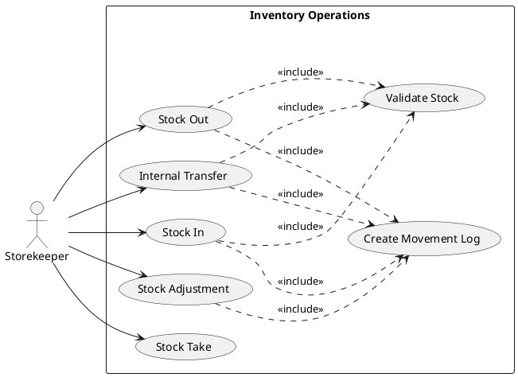

**Description**: Shows Storekeeper actor interacting with use cases: Stock In, Stock Out, Internal Transfer, Stock Adjustment, Stock Take, with includes relationships to Validate Stock, Create Movement Log.

---

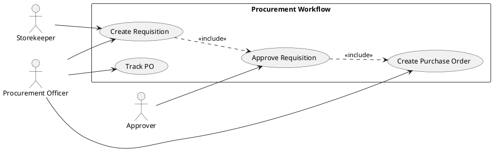

**Description**: Shows actors (Storekeeper, Procurement Officer, Approver) and use cases (Create Requisition, Approve Requisition, Create Purchase Order, Track PO) with workflow relationships.

---

### Appendix B: Data Flow Diagrams

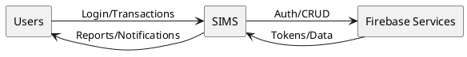

**Description**: External entities (Users, Firebase Services) interacting with SIMS system showing major data flows (Login Credentials, Inventory Transactions, Reports).

---

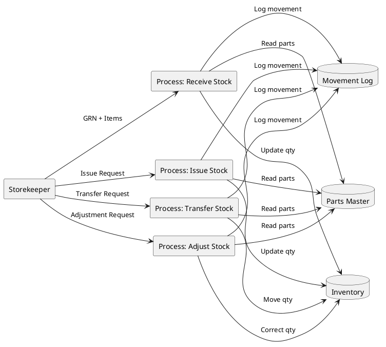

**Description**: Decomposition showing sub-processes (Receive Stock, Issue Stock, Transfer Stock, Adjust Stock) with data stores (Parts Master, Inventory, Movement Log) and data flows between them.

---

### Appendix C: Entity Relationship Diagrams

```plantuml
@startuml
hide methods
hide stereotypes
skinparam classAttributeIconSize 0

class User { userId }
class Group { groupId }
class Part { partId }
class Supplier { supplierId }
class Location { locationId }
class Inventory { inventoryId }
class Movement { movementId }

User "1" -- "1" Group
Supplier "1" -- "*" Part
Part "1" -- "*" Inventory
Location "1" -- "*" Inventory
User "1" -- "*" Movement
Part "1" -- "*" Movement
@enduml
```

**Description**: Shows entities (User, Group, Part, Supplier, Storage Location, Inventory, Movement) with relationships (User belongs to Group, Part stored in Location, Movement references Part) and cardinalities.

**Key Relationships:**

- User (1) → (N) Movement (user creates many movements)
- Part (1) → (N) Inventory (part stored in many locations)
- Supplier (1) → (N) Part (supplier supplies many parts)
- Location (1) → (N) Inventory (location contains many parts)
- Part (1) → (N) Movement (part appears in many movements)

---

```plantuml
@startuml
hide methods
hide stereotypes
skinparam classAttributeIconSize 0

class PurchaseRequisition { prId }
class PurchaseOrder { poId }
class Supplier { supplierId }
class User { userId }
class Part { partId }

User "1" -- "*" PurchaseRequisition : creates
PurchaseRequisition "1" -- "*" PurchaseOrder : converts to
Supplier "1" -- "*" PurchaseOrder : receives
PurchaseRequisition "*" -- "*" Part : line items
PurchaseOrder "*" -- "*" Part : line items
@enduml
```

**Description**: Shows PurchaseRequisition, PurchaseOrder, Supplier entities with relationships and attributes.

---

### Appendix D: Sequence Diagrams

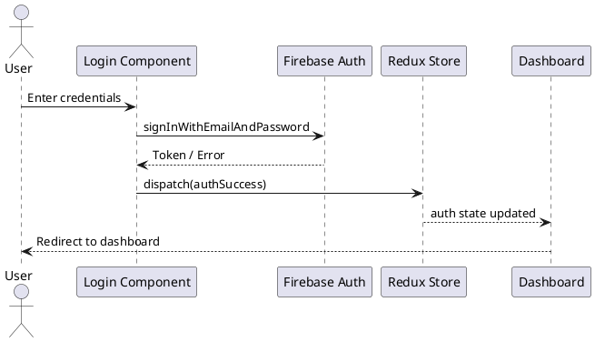

**Description**: Sequence showing interactions between User, Login Component, Firebase Auth, Redux Store, and Dashboard Component during login process.

**Steps:**

1. User enters credentials
2. Component calls Firebase Auth
3. Firebase validates and returns token
4. Component dispatches Redux action
5. Redux updates auth state
6. Component redirects to dashboard

---

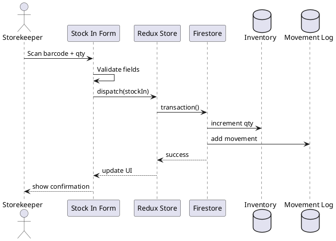

**Description**: Sequence showing Storekeeper, Stock In Form, Redux Store, Firestore, and Inventory Collection interactions during stock receipt.

**Steps:**

1. Storekeeper scans barcode
2. Form populates part data
3. Storekeeper enters quantity and location
4. Form validates input
5. Redux dispatches stock in action
6. Firestore transaction updates inventory
7. Movement log entry created
8. Success confirmation displayed

---

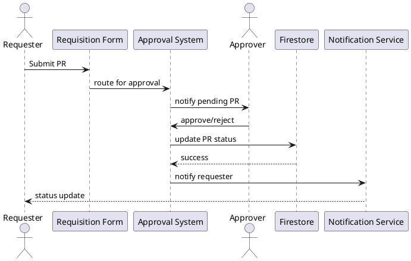

**Description**: Sequence showing Requester, Requisition Form, Approval System, Approver, Firestore, and Notification System.

**Steps:**

1. Requester submits PR
2. System routes to approver
3. Approver reviews PR
4. Approver approves/rejects
5. System updates PR status
6. System notifies requester
7. Approved PR available for PO creation

---

### Appendix E: User Interface Mockups

```plantuml
@startuml
salt
{
{T Login}
{
  [Logo]
  { Email | "" }
  { Password | "" }
  [ ] Remember Me
  [ Login ]
  [Forgot Password]
}
}
@enduml
```

**Description**: Login page showing email field, password field, "Remember Me" checkbox, "Login" button, "Forgot Password" link, and application logo. No self-registration available.

---

```plantuml
@startuml
salt
{
{T Dashboard}
{
  [KPI: Stock Value]  [KPI: Parts Count]  [KPI: Low Stock]
  [KPI: Today Movements]
  --
  { Recent Activity | }
  [Quick Actions]  [Low Stock Alerts]
}
}
@enduml
```

**Description**: Dashboard showing KPI cards (Total Stock Value, Parts Count, Low Stock Items, Today's Movements), recent activity table, quick action buttons, and low stock alerts panel.

---

```plantuml
@startuml
salt
{
{T Parts Master}
{
  { Search | "" }  [Filter]
  [Add New Part]
  --
  {#
  Part No | Description | Category | Unit | Reorder | Status
  1001 | Bearing | Mechanical | PCS | 10 | Active
  1002 | Motor | Electrical | PCS | 5 | Active
  }
  [Prev] [1] [2] [Next]
}
}
@enduml
```

**Description**: Data table showing columns (Part Number, Description, Category, Unit, Reorder Level, Status) with search bar, filter dropdowns, "Add New Part" button, and pagination controls.

---

```plantuml
@startuml
salt
{
{T Stock In Form}
{
  { GRN No | "" }
  { Supplier | "" }
  { Barcode Scan | "" }
  { Part | "" }
  { Quantity | "" }
  { Location | "" }
  { Unit Cost | "" }
  [ Save ]  [ Cancel ]
}
}
@enduml
```

**Description**: Modal form showing GRN number field, supplier dropdown, barcode scan field, part selector, quantity input, storage location selector, unit cost field, "Save" and "Cancel" buttons.

---

```plantuml
@startuml
salt
{
{T Reports}
{
  { Date Range | "" }  { Category | "" }  { Location | "" }
  [Apply Filters]
  --
  {#
  Report Table | Results
  }
  [Export CSV] [Export PDF]
}
}
@enduml
```

**Description**: Report page showing filter panel (date range, part category, location), data table with results, chart visualization, and export buttons (CSV, PDF).

---

### Appendix F: Glossary

**A**

- **Admin**: User with full system access and administrative privileges
- **Asset**: Physical equipment or machine tracked in the system
- **Audit Trail**: Complete record of all system transactions and changes

**B**

- **Barcode**: Machine-readable code representing part identification
- **Bin**: Specific storage position within a zone

**C**

- **Critical Spares**: High-priority parts essential for operations
- **Cycle Counting**: Periodic counting of specific inventory items
- **CRUD**: Create, Read, Update, Delete operations

**D**

- **Dashboard**: Main screen displaying key metrics and quick links
- **Department**: Organizational unit for cost allocation

**F**

- **Firestore**: Google's NoSQL cloud database service
- **FIFO**: First-In, First-Out inventory valuation method

**G**

- **GRN**: Goods Receipt Note documenting received goods
- **Group**: User role classification determining permissions

**I**

- **Inventory**: Quantity of parts currently in stock

**K**

- **KPI**: Key Performance Indicator measuring system metrics

**L**

- **Location**: Physical storage position for inventory

**M**

- **Master Data**: Reference data (parts, suppliers, locations)
- **Movement**: Any transaction changing inventory quantities
- **MRF**: Material Request Form for maintenance parts

**P**

- **Part**: Spare part, component, or material
- **PO**: Purchase Order sent to supplier
- **PR**: Purchase Requisition internal request

**R**

- **RBAC**: Role-Based Access Control security model
- **Reorder Level**: Minimum quantity triggering replenishment

**S**

- **Stock Adjustment**: Correction to inventory quantity
- **Stock Take**: Physical count of all inventory
- **Storekeeper**: User performing daily inventory operations
- **Supplier**: Vendor providing parts

**T**

- **Transaction**: Any operation affecting inventory or master data

**W**

- **Warehouse**: Primary storage facility
- **Work Order**: Maintenance job requiring parts

**Z**

- **Zone**: Section within a warehouse

---

## Document End

**For Questions or Clarifications:**
Contact Project Team at: [Contact Information]

**Document Control:**

- **Location**: Project Documents folder
- **Access**: Project team, stakeholders, management
- **Updates**: Versioned updates with approval required

**Related Documents:**

- Project README
- Completion Report
- Testing Guide
- Quick Reference Guide
- Integration Summary
- Implementation Checklist
- Sprint Reports (1-4)

---

**© 2026 AD-XPDC Development Team. All Rights Reserved.**
